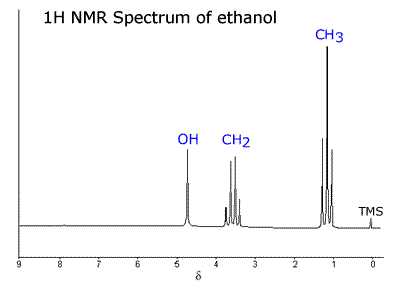

# NMR spectroscopy 

[Nuclear magnetic resonance (NMR)](https://en.wikipedia.org/wiki/Nuclear_magnetic_resonance) is a technique which probes the atomic nuclei in their chemical environment. It is used to determine content and purity of a sample and analyze molecular structure. The method is based on the Zeeman effect - the splitting of the spectral line in the presence of a static magnetic field. The nuclei under a static field are perturbed by a weak oscillating magnetic field near the resonant frequency of the nuclei. This produces a precession of the nuclear spins around the static magnetic field, which can be detected in the form of voltage induced in a coil. 1H and 13C are the most commonly used nuclei, however others are possible.  

The basic NMR experiment involves three sequential steps:
- Alignment (polarization) of the magnetic nuclear spins in a constant magnetic field (Zeeman effect)
- Perturbation of this alignment of the nuclear spins by a weak oscillating magnetic field, usually referred to as a radio-frequency (RF) pulse
- Detection of the NMR signal (free induction decay) in the form of oscillating voltage in the detection coil, due to the precession of the nuclear spins around the constant magnetic field

The information about the frequency is given as the chemical shift (ppm) which is independent of the magnetic field. 

