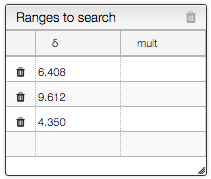
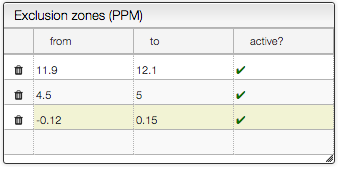
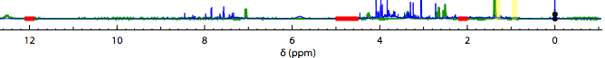
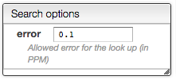
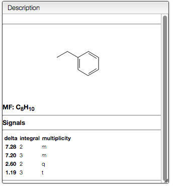
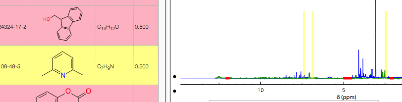
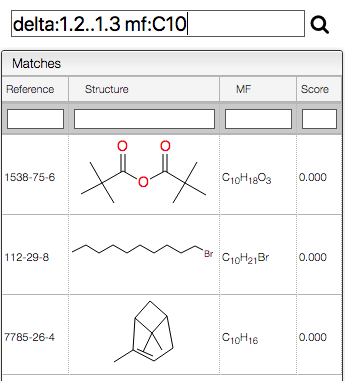
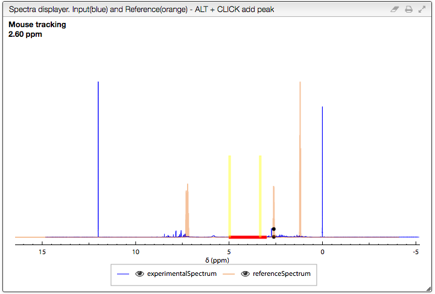

# Search by NMR chemical shifts

This tool is designed to search by NMR chemical shifts that may be practical to find similar pure products or identify products in complex mixture like in the case of metabolomics. In order to select the chemical shifts you may either enter directly the values in the table `Ranges to search` or ALT + CLICK directly on the spectrum.

You may at any time either delete one of the lines by clicking on the trash icon in front of the row, or you may delete all the chemical shifts by clicking on the trash in the top right of the table. You may as well specify the multiplicity. The score will receive some bonus if the multiplicity match (and can therefore have a score over one).

## Adding an experimental spectrum

Experimental spectrum can be added either by click on `Load demo`, by drag & drop a Jcamp file or by clicking on an existing spectrum from the database. Those spectra will be filtered based on the `Exclusion zones`.

The exclusion zones will be indicated on the spectrum by a red line.

## Specify the allowed error and display the result

While searching for similar spectra the program will allow an error on the chemical shift. This error is specified in:

Each peak will be represented as an allowed zone by a blue rectangle.

And the signals of the 10 best matches will be represented as 10 different lines. The color will represent the score:

- light green: > 0.8
- orange : 0.6 < score <= 0.8
- pink : score 0.4 < score <= 0.6

Mouse over the annotations will highlight the corresponding molecule. If you click on the annotation you will get the detailed information.

## Interactive results ...

Mouse over in the list of reference products will highlight the region where peaks are expected

This allows to quickly browse through the list of the reference spectra. If one of the reference looks promising, just click on it to display the reference corresponding NMR spectrum.

## Quick search

You may enter complex query in order to search for reference products. This includes research on molecular formula, chemical shift and reference.

You may for example search for products that have a chemical shift between 10 and 11:

delta:10..11

Or combine queries for the chemical shifts as well as the molecular formula containing 10 carbons:

delta:2..2.1 delta:3..3.4 mf:C10

## The spectra displayer

The following options are available in the spectra displayer :

- click + drag + release : zoom in the spectrum
- double click: zoom out = display the full spectra
- SHIFT + double click : zoom out progressively
- scroll wheel : vertical scale
- select a series (click on the corresponding line in the legend) + scroll wheel : vertical scale of a specific series
- hide a series by clicking on the corresponding eye in the legend
