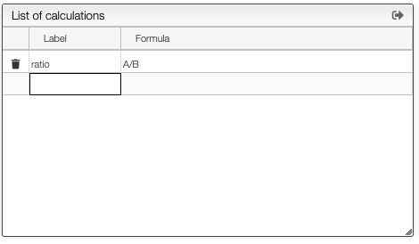
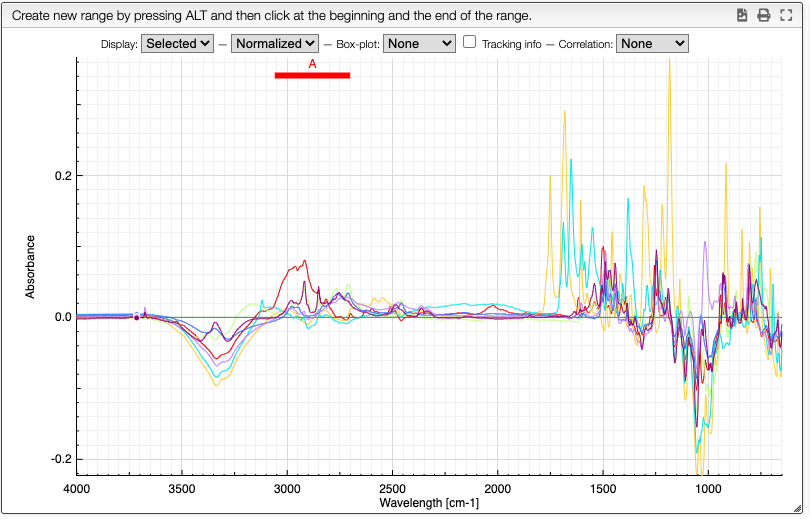
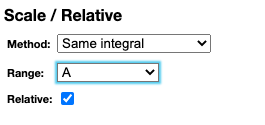

# Compare a bunch of spectra

Multiple spectra analysis allows to quickly extract information about a set of spectra.

## Spectra selection, normalization and previsualization

The first step is to select the spectra, and you may follow this [tutorial](spectraAnalysis_spectraSelection)

Once spectra have been selected, data normalization filters can be applied and [more information is available here](spectraAnalysis_normalization).

The superimposed spectra can be manipulated without numerous [advanced features described here](/eln-docs/spectra/common/visualization).

## Comparing spectra

Once you have superimposed spectra you can define ranges by maintaining alt pressed and click once left and right of the range you want to define.

A column will be added in the dataset table that contains the integration of the selected area. It is also possible to define more than one range by repeating this procedure.

In the `Define ranges` tab it is possible to rename the variables as well as to define custom formulae based on the ranges integration.

All the ranges and custom calculations will be automatically added in the table. From the table it is also possible to export all the data to a spreadsheet by clicking the export icon in the table toolbar.

## Relative spectra

It is possible to select a reference spectrum (target spectrum) so that all the other spectra are represented as the relative value to the target. To select the target spectrum click on the icon in the last column. The line will become green.

The target spectrum will now be a horizontal line.

In the preferences you can uncheck `Relative` to come back to the original view.

## Scaling spectra

Spectra can be rescaled based on the full spectrum or a specific range. Rescale can be based either on the integral, the minimal peak height or maximal peak height.
