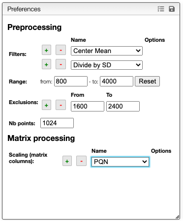
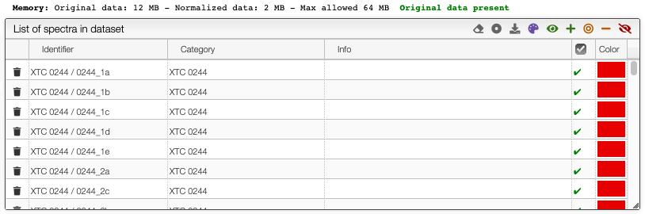
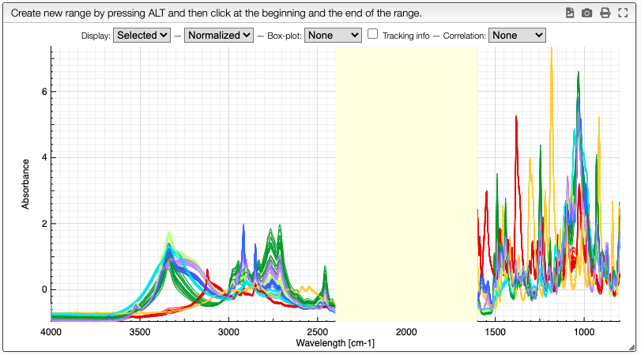

# Preprocessing

In order to compare spectra it is required to create a matrix. In this matrix each row corresponds to a spectrum while the columns are the various values for a specific X. To create this matrix we apply various preprocessing methods that consist to:

- filter the data in order to reduce the impact of sample preparation or experimental artifacts using various filters
- select the representative part of the spectra that is expected to be important for the analysis
- remove large peaks not characteristic to the sample (like water in NMR spectra) that could interfere with the analysis
- reduce the number of points in order to accelerate the analysis
- apply matrix related processing allowing to normalize the columns

## Filters

You may also apply various `Filters` that allows to normalize or transform the data. Among those filters we have:

- Center mean
- Divide by SD (standard deviation)
- Rescale: set the min value to 0 and the max value to 1
- Normalize: set the sum of all the points to 1
- Align: create a peak picking between `from` / `to` and calculate the mean X value between the `nbPeaks` highest peaks. The spectrum will be moved so that the mean has the `targetX` value.
- Pareto: Pareto scaling, which uses the square root of standard deviation as the scaling factor, circumvents the amplification of noise by retaining a small portion of magnitude information. [10.1016/j.molstruc.2007.12.026](https://dx.doi.org/10.1016/j.molstruc.2007.12.026)
- Savitzky-golay: smoothing spectra and calculate derivatives based on the following parameters:
  - `windowSize`: smoothing window, must be an odd number
  - `derivative`: enter 0, 1 or 2
  - `polynomial`: the degree of the polynomial used to calculate SG
- X function: a function that modifies the X axis based on the `x` parameter. Like for example `log(x)`
- Y function: a function that modifies the Y axis based on the `y` parameter. Like for example `log10(y+1)`

One classical preprocessing algorithm is [Standard Normal Variate (SNV)](http://wiki.eigenvector.com/index.php?title=Advanced_Preprocessing:_Sample_Normalization#SNV_.28Standard_Normal_Variate.29). This preprocessing can be achieved by selecting the 2 options `Center mean` and `Divide by SD`.

## Selecting the range

Only the information between the `From` and `To` values of the range will be considered.

## Exclusions

Depending on the analysis some region should be removed in order to improve the analysis. For example NMR spectroscopy in water yields to a large peak around 4.5ppm and using exclusion zone it can be removed from the analysis.

## Number of points

The data normalization process will select equidistant `Nb points` between the `From` and `To` values.

## Matrix processing

Once all the previous filters have been applied we obtain a matrix in which rows represent the normalized spectra and columns represent the intensity of teach spectrum.

Some filters are using the columns for further processing like:

- PQN: Probabilistic Quotient Normalization ([10.1021/ac051632c](https://dx.doi.org/10.1021/ac051632c))
- Center mean: for each column the mean of the values will be centered
- Rescale (0 to 1): for each column the min value will be set to 0 and the max value to 1

## Large dataset

The list of the spectra in the dataset is displayed in the following table:

In some cases it is not possible to keep in memory the original spectra and the system will only keep the normalized spectra. Therefore it will not be possible to change the normalization parameters anymore.

## Preview

A preview of the normalized spectra as well as the exclusions zones will be displayed. This allows to fine tune the processing.

The superimposed spectra can be manipulated without numerous [advanced features described here](../visualization/README.md).
