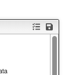
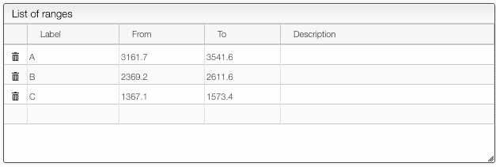
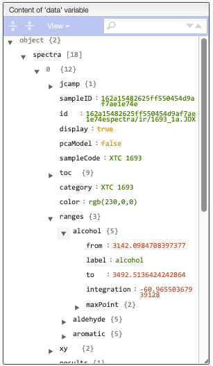
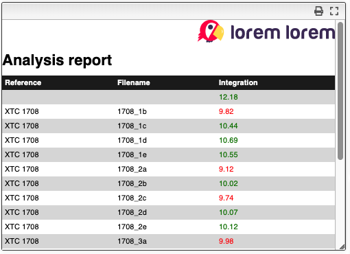

# Create analytical report from spectra

This program allows defining and apply analytical procedure on one or more spectra. The general principle is:

- select spectra
- define parameters for spectra normalization
- define ranges that will be associated to a variable and for which the following parameters are calculated:
  - integration
  - point for min y value
  - point for max y value

This software allows either to create new analytical report of to use an existing one.

## Spectra selection, normalization and previsualization

The first step is to select the spectra, and you may follow this [tutorial](spectraAnalysis_spectraSelection)

Once spectra have been selected, data normalization filters can be applied and [more information is available here](spectraAnalysis_normalization).

The superimposed spectra can be manipulated without numerous [advanced features described here](spectraAnalysis_visualization).

## Load existing analytical procedure

If analytical procedure has been defined previously it can be loaded by clicking on the `list` icon.



By clicking on the `disk` icon analytical procedure can be saved.

The following parameters are considered when loading / saving analytical procedure:

- preferences
- ranges that define variables
- code that calculates information from the spectra
- twig template that generates the report
- a free description explaining the analysis

## Create ranges

In the `Check results` tab you are able to define ranges in the spectrum and a variable name for each of the range as well as a description.


To define a zone press the `ALT` key and then click once on the left, once on the right of the range. A variable name will be automatically created and can easily be renamed from the table. A description for each variable can also be specified.



## Create a function to apply on the spectra

To create the function click on `Edit calculations` tab.

To define a formula you need to write a javascript code that will modify the variable `data`. This variable contains 2 properties:

- spectra: all the information related to the selected spectra
- report: an empty object that allows to store global statistics about the analysis

At anytime you can check the content of the variable `data` using the JSON explorer.



A basic example would be:

```js
for (let spectrum of data.spectra) {
  // You are free to define new properties in the empty object 'results'
  spectrum.results.ratio =
    (spectrum.ranges.alcohol.integration -
      spectrum.ranges.aldehyde.integration) /
    spectrum.ranges.aromatic.integration;
}
```

A more advanced and complete example is presented here:

```js
// The following line allows to have a log in the browser console.
// To display the console: `View → Developer → JavaScript Console`
// console.log(data);

/*
The data object gives access to the spectra as well as the report.
The report is a property of data that allows to store any global
information about the spectra.
*/

for (let spectrum of data.spectra) {
  // You are free to define new properties in the empty object 'results'
  spectrum.results.ratio =
    (spectrum.ranges.alcohol.integration -
      spectrum.ranges.aldehyde.integration) /
    spectrum.ranges.aromatic.integration;
}

/*
    You can calculate some statistics for all the spectra
*/
data.report.minAlcohol = Number.MAX_VALUE;
data.report.maxAlcohol = Number.MIN_VALUE;
for (let spectrum of data.spectra) {
  if (spectrum.ranges.alcohol.integration > data.report.maxAlcohol) {
    data.report.maxAlcohol = spectrum.ranges.alcohol.integration;
  }
  if (spectrum.ranges.alcohol.integration < data.report.minAlcohol) {
    data.report.minAlcohol = spectrum.ranges.alcohol.integration;
  }
}

/*
    You can even create a chart
*/
let points = { x: [], y: [] };
for (let spectrum of data.spectra) {
  points.x.push(points.x.length + 1);
  points.y.push(spectrum.results.ratio);
}

data.report.chart = {
  axes: {
    x: {
      label: "Sample number",
    },
    y: {
      label: "Ratio",
    },
  },
  series: [
    {
      data: points,
      label: "customLabel",
    },
  ],
};
```

In order to test the script you need to click on `Generate results`. You will see the new properties that you added in the JSON explorer.

## Design a report (Twig template)

The last tab, `Design report`, allows creating advanced reports for the analysis.

The reports are based on the
[Twig template engine](https://twig.symfony.com/doc/2.x/)

The report is principally written in HTML with at the top some CSS information. In is also possible to include an inline image (like the SVG of the company logo).

In order to limit the CSS to the report it is important to wrap the report in a div and to name it. Like for example `<div id="report">`. All the CSS selector with therefore start with `#report` to limit the CSS to this specific div.

Example:

```html
<style>
  #report {
    font-family: sans-serif;
  }
  #report h1 {
    padding-top: 10px;
    padding-bottom: 10px;
  }
  #report th,
  #report td {
    text-align: left;
    padding: 4px;
  }
  #report tr:nth-child(even) {
    background: #ddd;
  }
  #report tr:nth-child(odd) {
    background: #fff;
  }
  #report tr:first-child {
    color: white;
    background: #222;
  }
  #report table {
    border: 0;
    border-collapse: collapse;
    width: 100%;
  }
</style>
<div id="report">
  <div align="right">
    <svg
      id="Layer_1"
      xmlns="http://www.w3.org/2000/svg"
      viewBox="0 0 540.3 88.7"
      width="200"
    >
      <style>
        .st0 {
          fill: #4a3866;
        }
        .st1 {
          fill: #ff2753;
        }
        .st2 {
          fill: #fff;
        }
        .st3 {
          fill: #ffdd5a;
        }
      </style>
      <path
        class="st0"
        d="M51.9 81.9s-2.4 4.3 1.3 5.3c5.4 1.4 7.3-7.5 7.3-7.5l-8.6 2.2z"
      />
      <path
        class="st0"
        d="M52.8 82.1s-3.6 8-8.7 6.4c-5.1-1.6 1.4-7 1.4-7l7.3.6z"
      />
      <path
        class="st0"
        d="M46.2 81S39 91.8 34.4 87.2c-2.6-2.6 1.9-8.7 1.9-8.7l9.9 2.5z"
      />
      <path
        class="st1"
        d="M49.8 0C27.1 0 8.7 18.4 8.7 41.2c0 3.2.4 6.4 1.1 9.4-3 1.7-6.8 5-7 10.5h6.7s-8.1 4.6-8.4 11.6l6.1-1.4S.4 77.9.1 84.8l21-14.2c7.4 7.3 17.6 11.8 28.8 11.8C72.6 82.4 91 63.9 91 41.2 91 18.4 72.6 0 49.8 0z"
      />
      <path
        class="st2"
        d="M41.7 72.1l31.3-54S55.7 3.8 41.7 15.6c-16 13.5-13.3 46.2 0 56.5z"
      />
      <path
        class="st0"
        d="M60 28.1c0 5.2-4.2 9.5-9.5 9.5S41 33.4 41 28.1c0-5.2 4.2-9.5 9.5-9.5s9.5 4.3 9.5 9.5z"
      />
      <path class="st3" d="M60 56.4l30.3 25.1s36.1-48.6-10-61.1L60 56.4z" />
      <path
        class="st2"
        d="M94.3 37.6s8.5 6.6 1.8 15.4c.7-7.7-1.8-15.4-1.8-15.4z"
      />
      <g>
        <path
          class="st0"
          d="M142.8 26v48h-10.4V21h5.4c2.7-.1 5 2.3 5 5zM185.8 53.5c0 14.2-6.3 21.4-18.8 21.4s-18.7-7.2-18.7-21.4c0-14.4 6.2-21.4 18.7-21.4s18.8 7.1 18.8 21.4zm-27 0c.1 8 2.8 12.1 8.1 12.1s8-4.2 8-12.4c0-8-2.7-12-8-12s-8.1 4.1-8.1 12.3zM192 52.7c.3-13.3 7.4-20 21.2-20h1.5v10.8h-3.5c-5.8 0-8.7 3-8.7 9V74H192V52.7zM239.1 74.9c-12.5-.4-18.7-7.6-18.7-21.7 0-14 6.3-21.1 18.9-21.1 13.1 0 19.3 8 18.5 24.2h-26.7c.4 6.3 3.1 9.5 8.2 9.5 2.4 0 4.7-1 6.7-3 .9-1 2.1-1.5 3.5-1.5h7.6c-2.3 8.8-7.9 13.6-18 13.6zm-7.9-26h15.5c-.6-5.5-3.2-8.3-7.6-8.3s-7.1 2.8-7.9 8.3zM274.3 47.6V74h-10.5V49.7c0-11.8 5.9-17.6 17.7-17.6 5.3 0 9.4 1.2 12.3 3.5 3-2.3 7-3.4 12.3-3.4 11.8 0 17.6 5.8 17.5 17.6v24.3h-5.4c-3.4-.2-5.1-1.9-5.1-5.1V47.8c-.2-4.3-2.6-6.4-7.2-6.4s-6.9 2.1-7 6.4V74h-10.5V47.6c-.2-4.3-2.6-6.4-7.2-6.4-4.5 0-6.9 2.1-6.9 6.4zM359.5 26v48h-10.4V21h5.4c2.7-.1 5 2.3 5 5zM402.5 53.5c0 14.2-6.3 21.4-18.8 21.4S365 67.7 365 53.5c0-14.4 6.2-21.4 18.7-21.4s18.8 7.1 18.8 21.4zm-26.9 0c.1 8 2.8 12.1 8.1 12.1s8-4.2 8-12.4c0-8-2.7-12-8-12-5.4 0-8.1 4.1-8.1 12.3zM408.7 52.7c.3-13.3 7.4-20 21.2-20h1.5v10.8h-3.5c-5.8 0-8.7 3-8.7 9V74h-10.5V52.7zM455.8 74.9c-12.5-.4-18.7-7.6-18.7-21.7 0-14 6.3-21.1 18.9-21.1 13.1 0 19.3 8 18.5 24.2h-26.7c.4 6.3 3.1 9.5 8.2 9.5 2.4 0 4.7-1 6.7-3 .9-1 2.1-1.5 3.5-1.5h7.6c-2.2 8.8-7.9 13.6-18 13.6zm-7.9-26h15.5c-.6-5.5-3.2-8.3-7.6-8.3-4.4 0-7.1 2.8-7.9 8.3zM491 47.6V74h-10.5V49.7c0-11.8 5.9-17.6 17.7-17.6 5.3 0 9.4 1.2 12.3 3.5 3-2.3 7-3.4 12.3-3.4 11.8 0 17.6 5.8 17.5 17.6v24.3H535c-3.4-.2-5.1-1.9-5.1-5.1V47.8c-.2-4.3-2.6-6.4-7.2-6.4s-6.9 2.1-7 6.4V74h-10.5V47.6c-.2-4.3-2.6-6.4-7.2-6.4s-7 2.1-7 6.4z"
        />
      </g>
    </svg>
  </div>

  <h1>Analysis report</h1>
  <table>
    <tr>
      <th>Reference</th>
      <th>Filename</th>
      <th>Raio</th>
    </tr>
    
    <tr>
      <td>{{ spectrum.toc.reference }}</td>
      <td>
        {{ spectrum.jcamp.filename|replace({"spectra/ir/": "", ".jdx":"",
        ".JDX":""}) }}
      </td>
      <td>
        
        <span style="color: red">
          {{ spectrum.results.ratio|number_format(2) }}
        </span>
        
        <span style="color: green">
          {{ spectrum.results.ratio|number_format(2) }}
        </span>
        
      </td>
    </tr>
    
  </table>

  <h1>Global report</h1>
  <table>
    <tr>
      <th>Over 10</th>
      <td>{{data.report.over10}}</td>
    </tr>
    <tr>
      <th>Min alcohol</th>
      <td>{{data.report.minAlcohol|number_format(2)}}</td>
    </tr>
    <tr>
      <th>Max alcohol</th>
      <td>{{data.report.maxAlcohol|number_format(2)}}</td>
    </tr>
  </table>

  <div style="text-align: center; width: 100%; height: 300px">
    {{rendertypeBlock(data.report.chart,'chart')}}
  </div>
</div>
```


