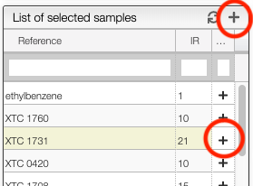
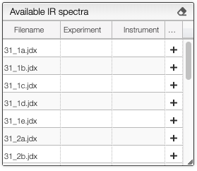

# Spectra selection

All the spectra analysis tools start with a phase of selection.

## Select samples

In order to facilitate the analysis of the spectra it is advised to have samples containing representative spectra in order to evaluate the intra-variability as well as the reproducibility.

Selection of spectra to analyze is achieved with one of those 3 methods:

At the level of the sample by either clicking on the `+`, this will add all the spectra related to this sample or on the `+` on the top of the sample box to add all the spectra of all the selected samples.

If you select a sample it is also possible to add a specific spectrum by clicking on the `+` at the level of the spectra list.

## What's next ?

Once spectra have been selected, data normalization filters can be applied and [more information is available here](../normalization/README.md).

The superimposed spectra can be manipulated without numerous [advanced features described here](../visualization/README.md).
