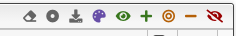
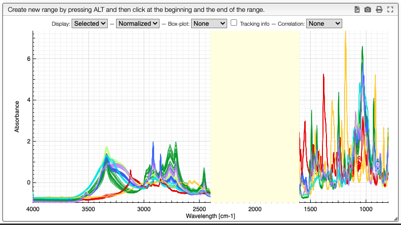
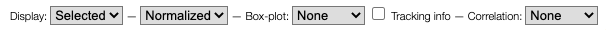
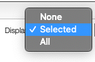
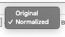
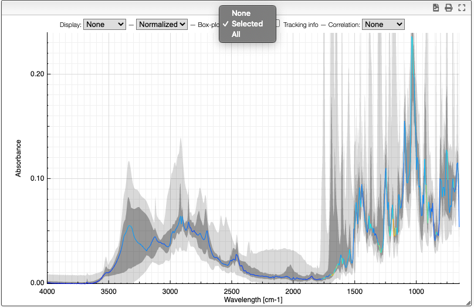
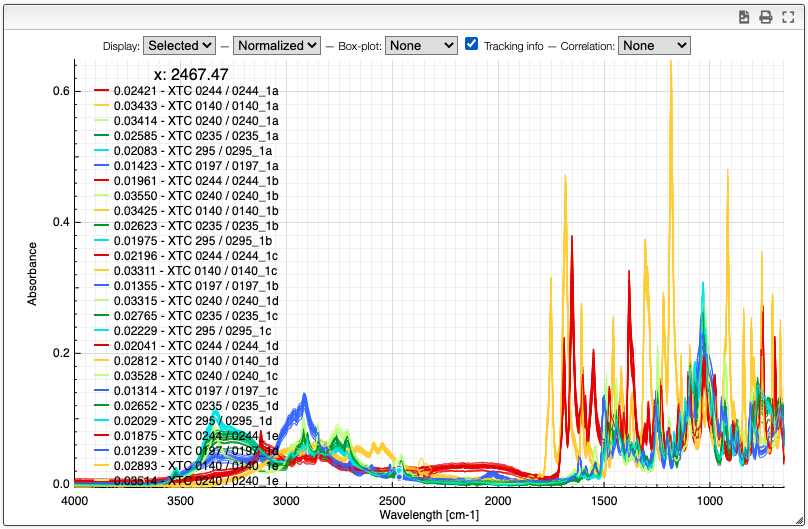
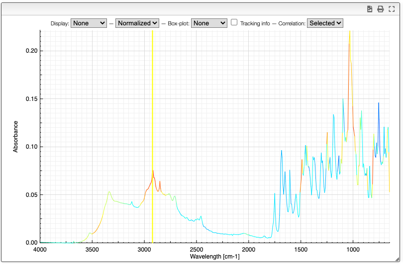

# Spectra visualization

Numerous options are available to display the either all the spectra in the dataset or the selected spectra in the dataset.

## Selection of spectra in the dataset

The toolbar on the top of the list of spectra in the dataset provides many options (from left to right):

- Remove all spectra from dataset
- Select category: select which property contains the category description
- Download normalized matrix
- Recolor spectra based on category: a different color will be applied for each category. By default, the sample reference
- Select all spectra
- Append to selected spectra
- Select only current spectra
- Remove spectra from current selection
- Unselect all spectra

## Graph options

It is possible to either display the selected spectra, all the spectra or various derived information.

Customization of the display is achieved using the chart toolbar:

### Display spectra

The first options allow to either display all the spectra, only the selected spectra or nothing.

Displaying no spectrum is useful when displaying other derived data.

### Original / normalized

These options allow to either display the original spectra or the normalized data. Most of the time we will display normalized data. Those are the data that will be analyzed, and normally they also take less room in memory.

### Boxplot

The boxplot kind of representation allows to display the first / third quartile as a dark grey zone for each X point. The min and max values are represented as a light gray zone and the median is represented as a line for which the color varies based on the standard deviation (red: high variation, blue: small variation).

### Tracking information

By selecting the tracking information you will display the X values and the corresponding Y values for all the spectra.

### Correlation

Correlation of the vector represented by the Y points can be useful to determine which peaks are correlated in a big mixture of products. This is known in NMR metabolomics as [STOCSY](https://dx.doi.org/10.1021/ac048630x).

By SHIFT + ALT + click you can select the X value for which you would like to check correlation. Strongly correlated signals will appear in red while non correlated signals are blue.

