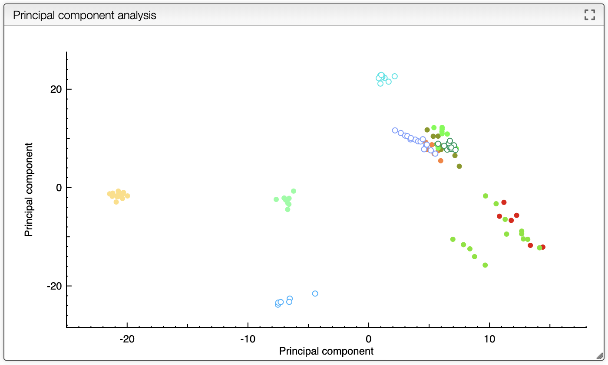
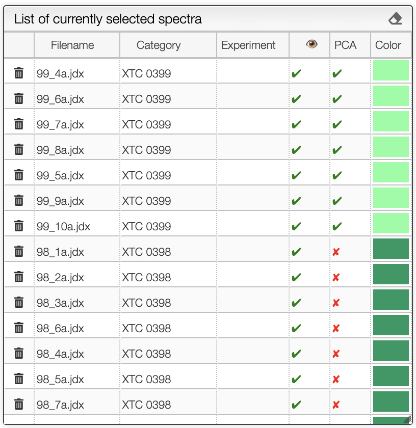
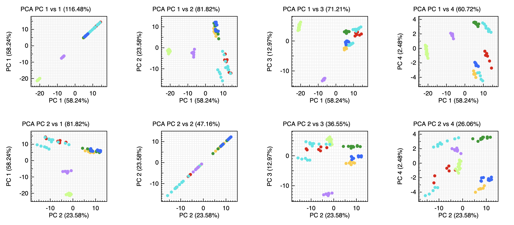

# Calculate PCA for spectra

While superimposing spectra allows checking differences between 2 or 3 experiments it become tedious to compare a large set of data.

Many data mining algorithms may help in those cases and here we propose to analyze the data using principal component analysis.

Principal component analysis (PCA) is a statistical procedure that uses an orthogonal transformation to convert a set of observations of possibly correlated variables (here spectra) into a set of values of linearly uncorrelated variables called principal components. If there are n observations with p variables, then the number of distinct principal components is min(n-1,p). This transformation is defined in such a way that the first principal component has the largest possible variance (that is, accounts for as much of the variability in the data as possible), and each succeeding component in turn has the highest variance possible under the constraint that it is orthogonal to the preceding components. The resulting vectors (each being a linear combination of the variables and containing n observations) are an uncorrelated orthogonal basis set. PCA is sensitive to the relative scaling of the original variables.

The workflow is the following:

- Select samples and add spectra
- Preprocess the spectra using various parameters
- Calculate the PCA
- Display each spectrum in the new space

<a href="spectraAnalysis_spectraSelection">.</a>

## Spectra selection, normalization and previsualization

The first step is to select the spectra, and you may follow this [tutorial](spectraAnalysis_spectraSelection)

Once spectra have been selected, data normalization filters can be applied and [more information is available here](spectraAnalysis_normalization).

The superimposed spectra can be manipulated without numerous [advanced features described here](spectraAnalysis_visualization).

## Create the PCA model

In order to generate the PCA model you should click on the `Recalculate PCA` button that can be found in the PCA tab.

Even after creating the model you may still add new spectra. Those spectra will be projected to the new PCA space. The spectra used for the calculations are represented using a filled circle while the one projected are represented with a circle.

By default each sample will have a different color.

In the list of selected sample you can check which spectra are used for the PCA calculation and which one are just projected on the model.

## Advanced analysis

By selecting `PCA PC` you can check the various principal component as well as the explained variance.

While PC1 versus PC2 offers usually a good separation it is not always the best that can be achieved and in this view we plot the 4 first principal components against each other.

In this specific example we can see that the best separation is obtained when using PC2 versus PC3.

## References

- doi.org/10.1007/s11483-012-9279-7
