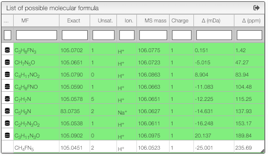

## Results table

This tool calculates on-the-fly the possible molecular formula based on a monoisotoipc mass and possible ionizations.

The resulting table will contain green background lines if this molecular formula exists in PubChem. This is an excellent way to find plausible molecular formula of unknown products.

The results contain various columns:

- the NON-IONIZED molecular formula
- the monoisotopic mass of the NON-IONIZED molecule
- the unsaturation degree
- the ionization
- the observed mass
- the total charge (with ionization)
- the error in mDa
- the absolute value of the error in ppm
