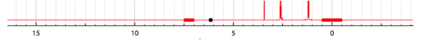

## NMR superimposition user guide

This view allows superimposing 1D and 2D spectra.
Click on a sample from the `List of selected samples`.

The list of NMR spectra available for the sample will appear in the upper module just to the right. Go to the row of your interest and click on either the Red, the Blue or the Green column to have the corresponding spectrum plotted in the chosen color. Choose a different spectrum (it may be from a different sample) and a different color to plot it superimposed over the first one. You may have up to three 1D and three 2D spectra superimposed.

### Exclusion of some ranges

It is possible to exclude some ranges of the spectra in order to compare them more easily. This is for example the case when you are doing NMR spectra in water.
Enter the ranges to exclude in the corresponding table:

Red lines will appear on the 1D spectrum showing the zones that are excluded.

### Spectra displayer

For 1D NMR spectra, the following options are available in the spectra displayer :

- click + drag + release : zoom in the spectrum
- double click: zoom out = display the full spectra
- SHIFT + double click : zoom out progressively
- scroll wheel : vertical scale
- select a series (click on the corresponding line in the legend) + scroll wheel : vertical scale of a specific series
- hide a series by clicking on the corresponding eye in the legend

For 2D NMR spectra the following options are available :

- draw a rectangle to zoom in a specific zone of the spectrum
- double click: zoom out = display the full spectra
- SHIFT + double click : zoom out progressively
