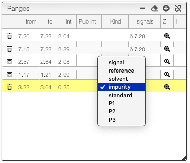

## Relative mass

In the range table it is possible to define if a range is:

- signal: normal signal of the molecule
- reference (like TMS)
- solvent (like residual CHCl3)
- impurity
- standard
- P1: assignment of a minor product
- P2: assignment of a second minor product
- P3: assignment of a third minor product

Reference, solvent, impurity and standard will not be taken into account for the integral sum.

