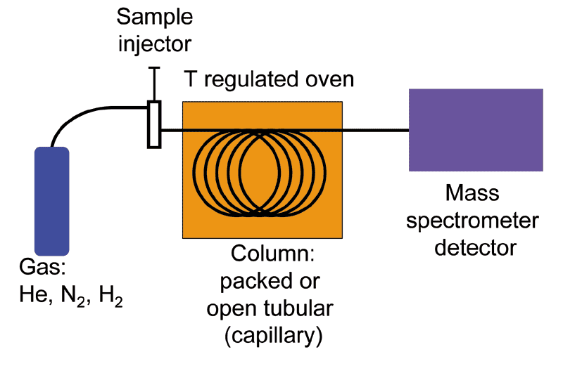
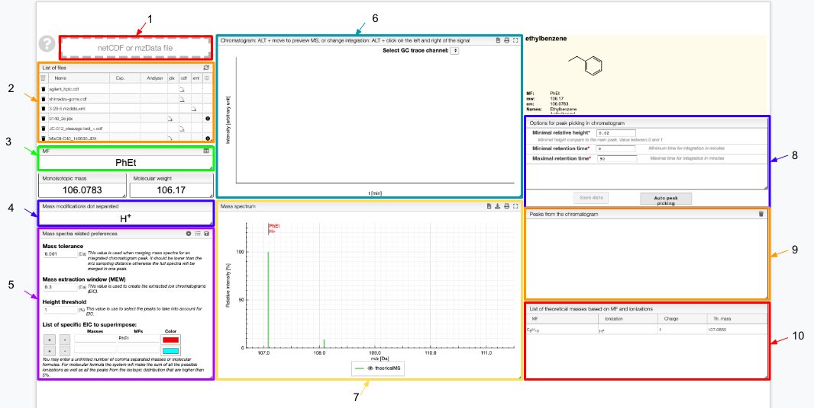
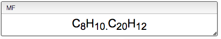
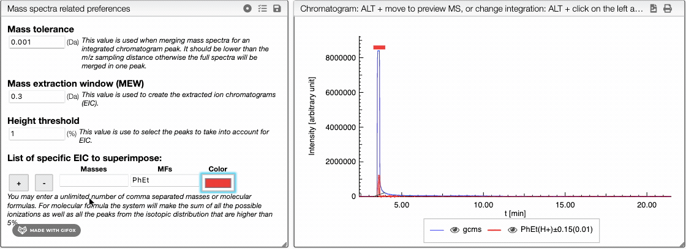
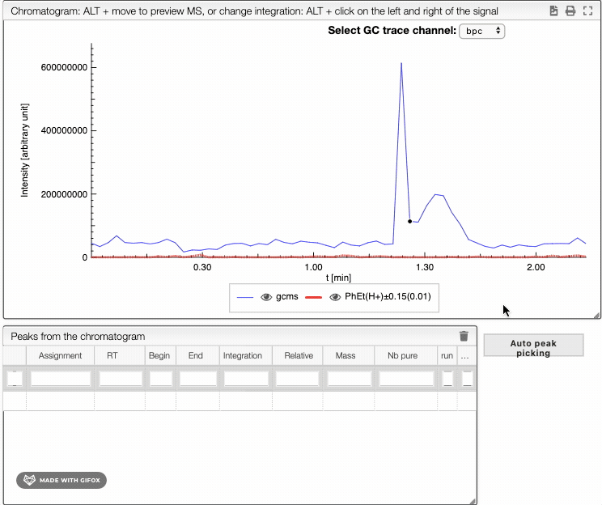
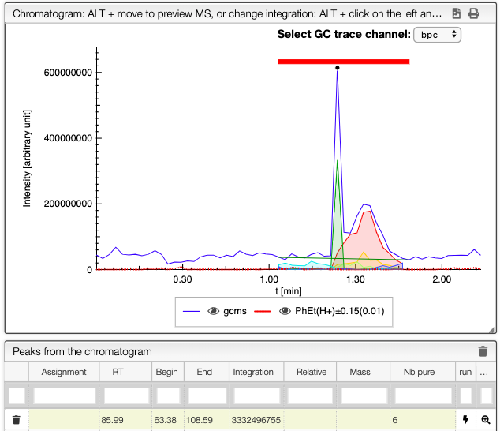
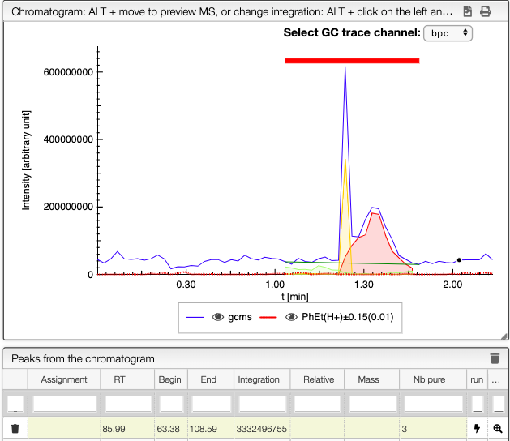
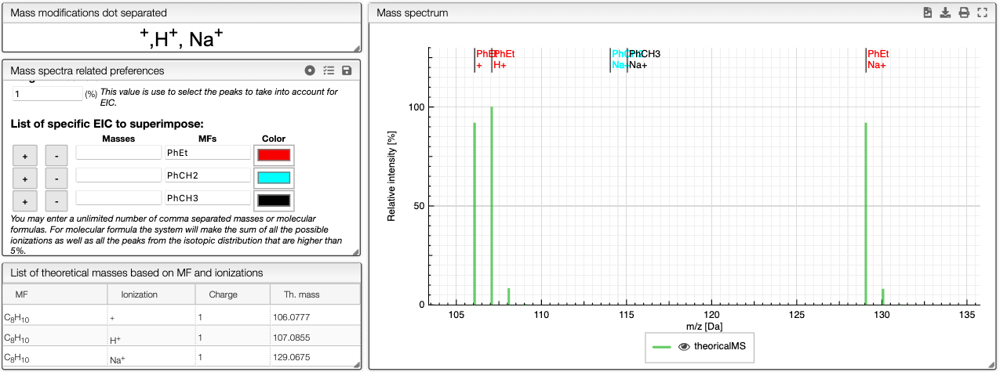

import Jcamp from '../../includes/jcamp/README.md'

# GC / LC-MS visualization

This application enables the visualization and integration of GC / LC data with or without MS.

## Introduction 

### GC-MS
[Gas chromatography- mass spectrometry](https://en.wikipedia.org/wiki/Gas_chromatography–mass_spectrometry) (GC-MS) is an analytical technique that combines gas chromatography and mass spectrometry to identify different substances within a sample. It allows analysis and detection of tiny amounts of a substance by separation of the substances with the gas chromatograph, then identification with the mass spectrometer. 

First, the sample  goes through the gas chromatograph. The different chemical compounds are separated according to their relative affinity for the stationary phase of a capillary column. The molecules come out of the column at different times (retention times) and therefore enter at differents times into the mass spectrometer. In the mass spectrometer, the molecules are breaking into ionized fragments that are detected using their mass-to-charge ratio. 

Different ionization techniques can be chosen, but the most common form is the electron ionization (EI). The molecules entering the mass spectrometer are bombarded with free electrons causing their fragmentation in a characteristic and reproducible way. 

### LC-MS

[Liquid chromatography-mass spectrometry](https://en.wikipedia.org/wiki/Liquid_chromatography–mass_spectrometry) (LC-MS) is an analytical method that combines liquid chromatography with mass spectrometry. The principle of separation-identification is basically the same as GC-MS. Here however, the components are separated according to their affinity with both a stationary phase and a mobile phase. 

A LC-MS spectrum looks like the following: 

## Overview 

1. Drag and drop your file 
2. List of the files: select one of them to display
3. Molecular formula of your molecule 
4. Enter the ionization method(s) used
5. Enter your preferences related to the mass spectra and save them 
6. Chromatogram
7. Mass spectrum 
8. Options for the peak picking and auto peak picking 
9. Peaks extracted from the chromatogram 
10. List of theoretical masses based on the molecular formula and ionization method you entered

## Loading files

Files can be uploaded either as a [JCAMP](http://jcamp-dx.org/), [NetCDF](https://en.wikipedia.org/wiki/NetCDF), [MzData, MzML or MzXML](https://en.wikipedia.org/wiki/Mass_spectrometry_data_format#mzData) format. Multiple files can be drag and dropped or selected from your computer by clicking on zone 1. The files are listed below the drop zone and are visualized when clicked.

:::tip JCAMP format

    

    Informations about the JCAMP format.
    

    

<Jcamp/>

:::

:::info
In the list of files, several icons appear: 
-  to remove a file from the list 
-  to dowload the resource file 
-  to get information about the spectrum 
-  to reload sample from the server. Caution: it will discard your local modifications. 
:::

## Molecular Formula (MF) and mass modification

You can enter several molecular formulas by separating it with a dot as shown below. 

For single formula, the monoisotopic mass and molecular weight are displayed below. For several formulas, the sum of the masses is displayed. 

In order to calculate the theoretical masses you need to define the ion adduct. Many adducts can be defined at once by separating with commas. You may also define multiple charges.

All the possible masses (based on input formula and ion adducts) are displayed as a virtual green spectrum, and listed in the `List of theoretical masses` tab.

## Mass Spectra Related Preferences

This section contains global settings for the manipulation of mass spectra and extracted ion chromatograms \(EIC\). 

The `mass tolerance` is the tolerance used when merging mass spectra for an integrated chromatogram peak. If the distance between two peaks is below this critical value, the two peaks are merged into one single peak. The mass tolerance should be lower than the m/z sampling distance otherwise the full spectra will be merged in one peak. 

The `mass extraction window` determines the minimum and maximum extracted masses for EIC based on the input m/z.

When entering a molecular formula the system will calculate the isotopic distribution and will combine the peaks that are closer than the `mass extraction window`. The peaks of the isotopic distribution that have a relative height over the `height threshold` will be considered and included in EIC.

The `list of specific EIC to superimpose` can be used to manually input specific masses and formula for creation of EIC. You can enter an unlimited number of comma separated masses or molecular formulas. For molecular formula, the system will make the sum of all the possible ionizations as well as the peaks from the isotopic distribution that are higher than 5%. You can use this tool to visualize the amount of particular fragments or impurities present in your sample. 
You can either enter a mass or a molecular formula and use  and  buttons to add or remove an element of the list. You may also change the color of each element. 

:::tip 
Your preferences can be saved in order to use them whenever you want. To do so, use:
-  to save your preferences. Give it an easily identifiable name. 
-  to return to the default preferences. 
-  to reload previous preferences. All the preferences that you saved are stored and you can reload them whenever you want.
:::

## Chromatogram 

Three GC trace channels are available: 
- [total ion current chromatogram](https://en.wikipedia.org/wiki/Mass_chromatogram#Total_ion_current_(TIC)_chromatogram) (tic) 
- base peak chromatogram 

Select the one that you want on the top right of the chromatogram.

To integrate your peaks, you can either select auto peak picking, which will automatically recognize the peaks, or integrate by hand using ALT + click on the left and the right limits of your peak. The auto peak picking shows you the integration region and the identified peaks. 

When several peaks are superimposed, you can use a deconvolution algorithm that will recognize the different peaks. It will suggest an ideal guess for the number of peaks, but you can change this number. The peaks identified would appear in different colors.
See below the spectra obtained for different numbers of compounds in the same integration region. 

          

:::info
You can download the chromatogram as a SVG file and print it using the two icons on the top right of the tab. 
:::

## Mass spectrum

The mass spectrum tab displays the theoretical mass spectrum.  The calculations consider the ionization method selected and the list of molecular formulas that you entered. The name of the species that appear in the spectrum are colored according to your choice in `Mass spectra related preferences` tab, and the ionization method is specified under each name. 

The theoretical masses are gathered in a table under `List of theoretical masses based on MF and ionizations`. 

