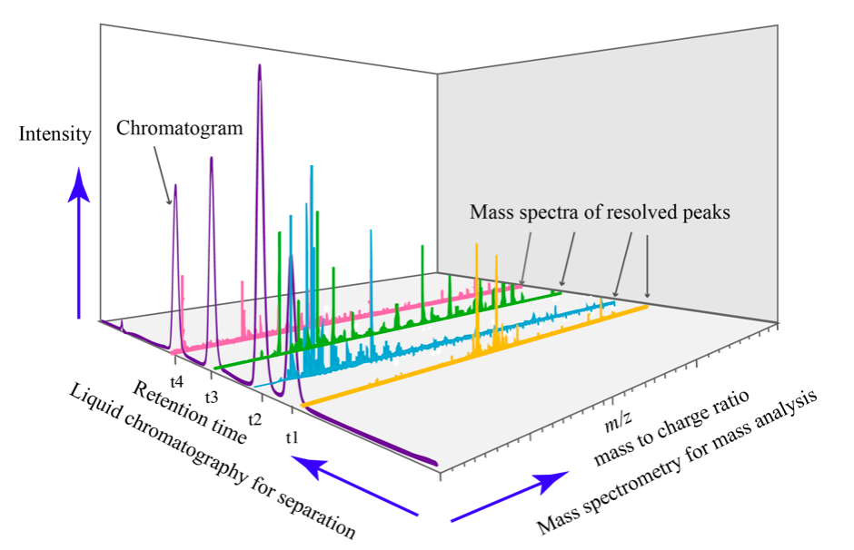

# GC / LC-MS visualization

This application enables the visualization and integration of GC / LC data with or without MS.

## Introduction 

### GC-MS
[Gas chromatography- mass spectrometry](https://en.wikipedia.org/wiki/Gas_chromatography–mass_spectrometry) (GC-MS) is an analytical technique that combines gas chromatography and mass spectrometry to identify different substances within a sample. It allows analysis and detection of tiny amounts of a substance by separation of the substances with the gas chromatograph, then identification with the mass spectrometer. 

First, the sample  goes through the gas chromatograph. The different chemical compounds are separated according to their relative affinity for the stationary phase of a capillary column. The molecules come out of the column at different times (retention times) and therefore enter at differents times into the mass spectrometer. In the mass spectrometer, the molecules are breaking into ionized fragments that are detected using their mass-to-charge ratio. 

Different ionization techniques can be chosen, but the most common form is the electron ionization (EI). The molecules entering the mass spectrometer are bombarded with free electrons causing their fragmentation in a characteristic and reproducible way. 

### LC-MS

[Liquid chromatography-mass spectrometry](https://en.wikipedia.org/wiki/Liquid_chromatography–mass_spectrometry) (LC-MS) is an analytical method that combines liquid chromatography with mass spectrometry. The principle of separation-identification is basically the same as GC-MS. Here however, the components are separated according to their affinity with both a stationary phase and a mobile phase. 

A LC-MS spectrum looks like the following: 

## Overview 

1. Drag and drop your file 
2. List of the files: select one of them to display
3. Molecular formula of your molecule 
4. Enter the ionization method(s) used
5. Enter your preferences related to the mass spectra and save them 
6. Chromatogram
7. Mass spectrum 
8. Options for the peak picking and auto peak picking 
9. Peaks extracted from the chromatogram 
10. List of theoretical masses based on the molecular formula and ionization method you entered

## Loading files

Files can be uploaded either as a [JCAMP](../../includes/jcamp/README.md), [NetCDF](https://en.wikipedia.org/wiki/NetCDF), [MzData, MzML or MzXML](https://en.wikipedia.org/wiki/Mass_spectrometry_data_format#mzData) format. Multiple files can be drag and dropped or selected from your computer by clicking on zone 1. The files are listed below the drop zone and are visualized when clicked.

:::info
In the list of files, several icons appear: 
-  to remove a file from the list 
-  to dowload the resource file 
-  to get information about the spectrum 
-  to reload sample from the server. Caution: it will discard your local modifications. 
:::

## Molecular Formula (MF)

Molecular formula are specified here. Several formulae can be defined by separating with a dot.

For single formula, the monoisotopic mass and molecular weight are displayed below.

## Mass modifications (ion adducts) and isotopic distribution

In order to calculate the theoretical masses you need to define the ion adduct. Many adducts can be defined at once by separating with commas. You may also define multiple charges.

All the possible masses (based on input formula and ion adducts) are displayed as a virtual green spectrum, and listed in the bottom-right.

## Mass Spectra Related Preferences

This section contains global settings for the manipulation of mass spectra and extracted ion chromatograms \(EIC\).

The **mass tolerance** is the tolerance used when integrating mass spectra into a chromatogram peak (should be less than the sampling distance).

The **mass extraction window** determines the minimum and maximum extracted masses for EIC based on the input m/z.

The **height threshold** defines the minimum relative height for a peak to be included in EIC.

The **list of specific EIC to superimpose** can be used to manually input specific masses and formula for creation of EIC.
