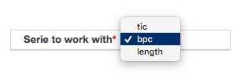
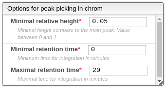

# Chromatogram visualization

When the desired file is clicked, the corresponding chromatogram is displayed, according to the following options:

- Series to work with: visualize and select peaks based on the total ion chromatogram \(tic\) or the base peak chromatogram \(bpc\).

## Peak picking in the chromatogram

### Automatic peak picking

Automatic peak picking is performed using parameters that filter and improve the results. This peak picking is based on the analysis of the first and second derivatives of the chromatogram; therefore, the beginning of the peak is where there is an inflection point. The parameters are the following:

- Minimal relative height: the minimal ratio between the height of the current peak and the highest peak.
- Minimum retention time: the retention time at which integration begins.
- Maximal retention time: the retention time at which integration ends.

### Manual peak picking

All automatic peak picks can be modified: first select the peak to be modified in the list of peaks (right), then ALT + click at the desired beginning of the peak followed by the desired end of the peak in the chromatogram. New peaks can be created using the button below the peaks table or by clicking on the plus icon above the table.

Note: automatic peak picking will replace any current peak selection, so it is recommended to use automatic peak picking first, followed by manual selection.
