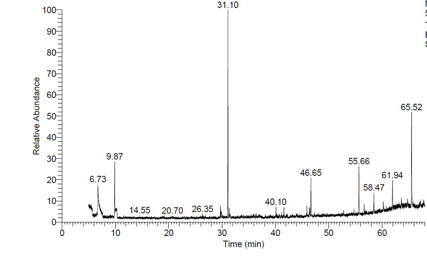

# GC/LC-MS chromatography 

Chromatography, such as [gas chromatography (GC)](https://en.wikipedia.org/wiki/Gas_chromatography) or [liquid chromatography (LC)](https://en.wikipedia.org/wiki/Liquid_chromatography%E2%80%93mass_spectrometry), is a laboratory technique used to separate mixtures. A sample is dissolved in a fluid (gas or liquid) that travels through a solid system (column, plate, sheet, or capillary tube). The fluid is often called the mobile phase and the system is called the stationary phase. Since different constituents of the mixture have different affinities for the stationary and mobile phases, they move at different apparent velocities. This difference in apparent velocities allows the components to be separated.
First, the mixture is separated and then the components are detected using mass spectrometry.

