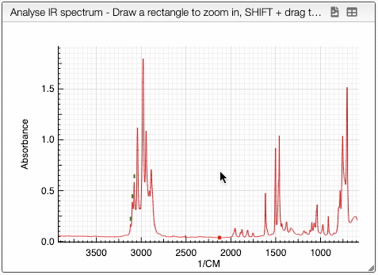

## Manipulating the spectrum

Once uploaded, you can select the spectrum on the right in the List of files tab. Once selected the spectrum will appear in the Analyse spectrum tab.

You can manipulate the graph in the following ways:
- SHIFT + drag on the graph to translate it
- Click + drag to zoom in on the selected window 
- Double click to return to default view
- Scroll the mouse wheel to rescale the y-axis of the spectrum
- SHIFT + double click to zoom out progressively

