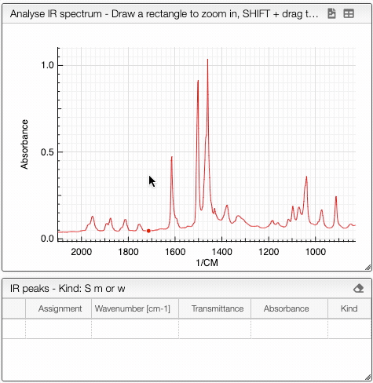

## Peak picking

It is possible to manually pick peaks in a spectrum by holding down the ALT key, and then left-clicking on the peaks of interest.

The application will systematically look for the strongest signal close to the wavelength that has been clicked.
The peaks will be stored in a separate tab.

The algorithm automatically classifies the peaks 

