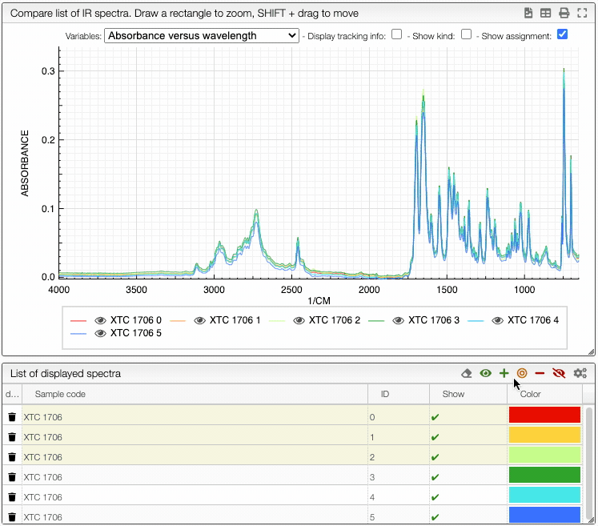
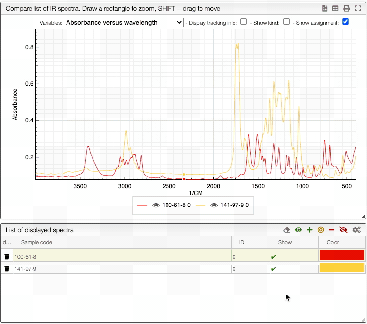

:::tip Visualising spectra

    

    How to show/hide spectra.
    

    

## Visualising spectra

If you wish to see only certain spectra, it is possible to selectively hide (or delete) them.

In order to do so, use the  buttons on the top panel of the displayed spectra list.

You can also change the color of an individual spectrum in the displayed spectra tab with a double click.

:::