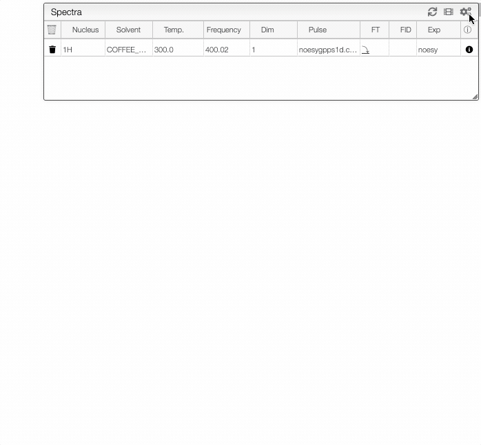

## Modifying table

You can modify the information displayed in certain tabs/tables. For instance, you may add or remove a column from a table with the data saved with the sample information.

Simply click on the  icon and modify the column of interest. Choose the column, type in the name you wish to be displayed and provide the corresponding information label. Your preferences are saved under your profile. 

