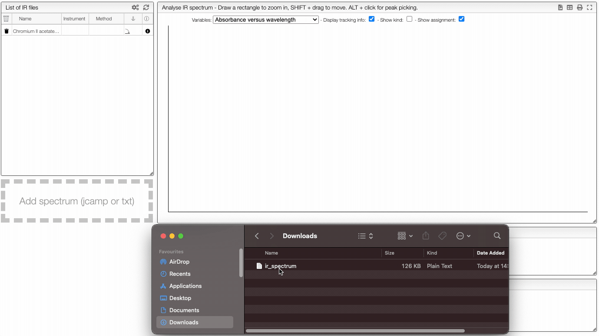

:::info Upload a file

    

    How to upload a file
    

    

In this view, it is possible to upload one or more spectra of a target sample by drag/drop either a jcamp or a text file. An individual spectrum can be visualized and analyzed by clicking on its name in the "List of files". Several spectra can also be compared. The information about the chosen sample can be found in the colored window on the right.

## Upload spectrum

You can upload a spectrum in 3 different ways:
- by dragging your files and then dropping them in the designated zone.
- by clicking on the upload zone and selecting the files to upload.
- by copying the spectrum into the clipboard and then pasting it using CTRL+V (or ⌘+V on MacOS).

**The format of the file to be uploaded should be jcamp (extension .dx or .jdx), this is the usual format used on most IR spectrophotometers.**

:::