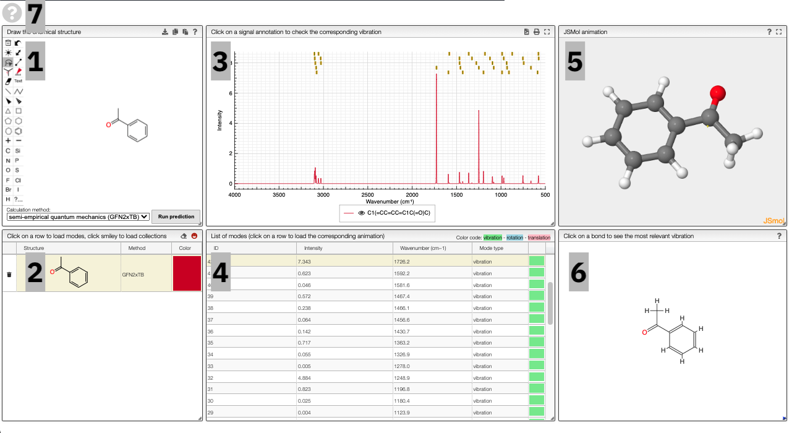
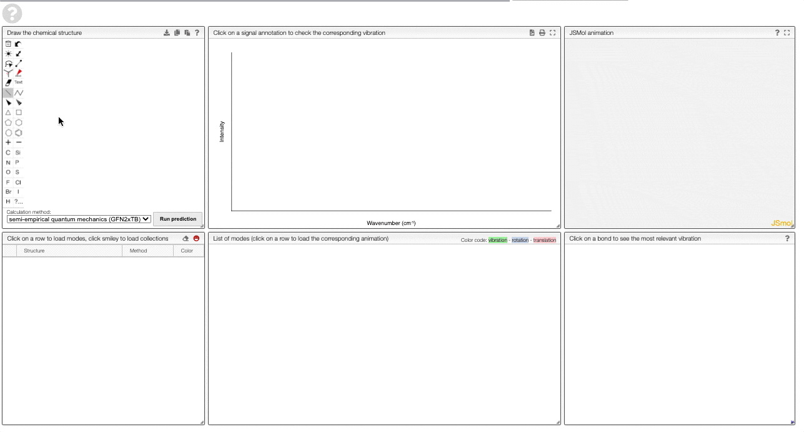
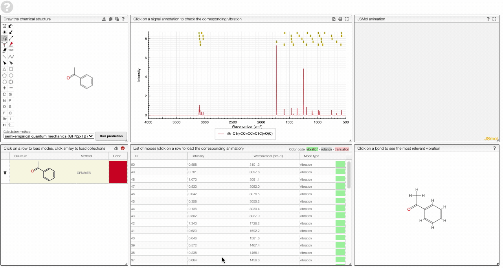
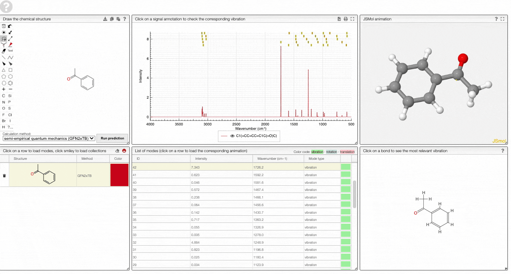
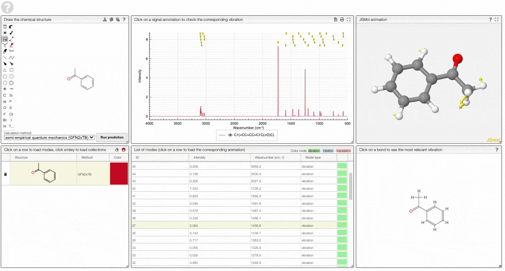
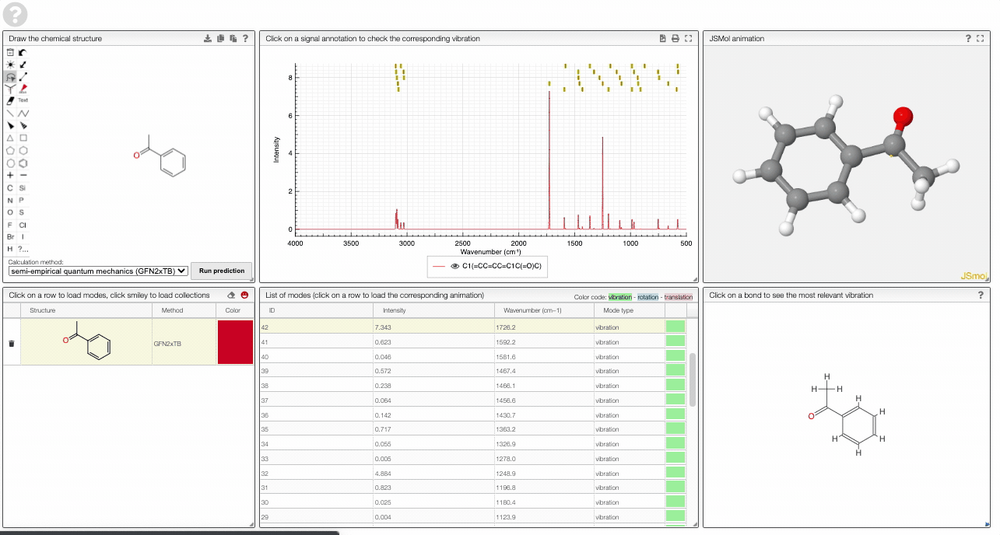
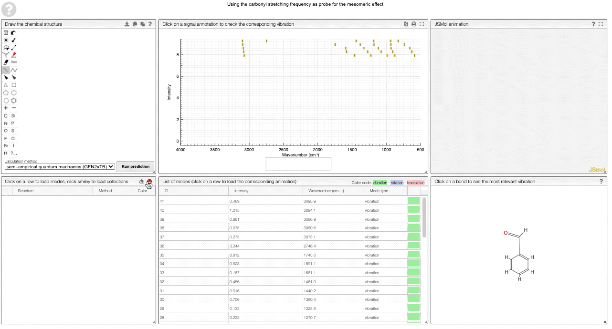
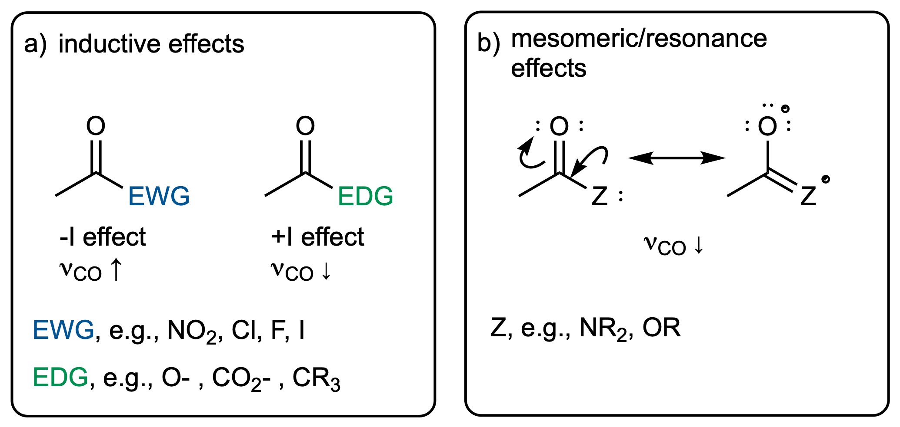
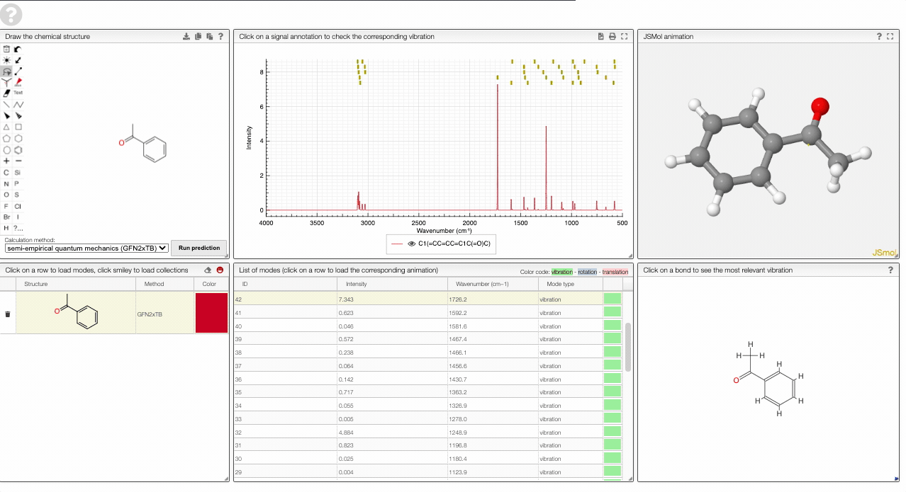

# IR spectra prediction

In infrared spectroscopy, broadband infrared light is typically passed through a sample and the transmitted light is dispersed and its spectral intensity recorded. The absorption lines reveal the excited vibrational transitions. In the following, we will discuss the theoretical background of these spectra and then show how they can be simulated.

## Theoretical background

### Selection rules

From theoretical spectroscopy one can derive that an electronic transition between some initial state $i$ and final state $f$ is allowed if the transition moment is not zero:

$$
|\mathbf{\mu}_{if}| = \left| \int \psi_{\mu_f}^* \mathbf{\mu} \psi_{\mu_i} \mathrm{d}V \right|
$$

If we assume that the Born-Oppenheimer approximation holds, we can separate the wave functions $\psi$ into an electronic and nuclear part and analyze them separately:

$$
\psi_\mu(\mathbf{r}) = \psi_e (\mathbf{r}_e, \mathbf{r}_N) \cdot \psi_N (\mathbf{r}_N)
$$

If we focus, for simplicity, on diatomic molecules we can decompose the nuclear motion into an oscillation (harmonic oscillator) and rotation (rigid rotator) part:

$$
\psi_N(\mathbf{r}_N) = \psi_v(q) \cdot \psi_{J, m_J} (\theta, \phi)
$$

with $q$ being the internuclear distance.

For vibrational transitions we can analyze only the contributions from the oscillation part, for which the wave function can be written as

$$
\psi_v(q) = A_v \cdot H_v(\alpha q) \exp\left(-\frac{-(\alpha q)^2}{2}\right)
$$

where the $H_v$ are Hermite polynomials.

For the vibrational transition, we can now evaluate

$$
\mathbf{\mu}_{if} = \int \psi^*_{V_f} (q) \mathbf{\mu} \psi_{V_i}(q) \, \mathrm{d}V
$$

For the diatomic case, we can simplify to one dimension by setting $q$ to $x$ and $\mathrm{d}V$ to $\mathrm{d}x$.

The first way this integral can vanish is if $\mathbf{\mu}$ is zero. This would mean we do not "see" this transition --- it is forbidden.

For small changes, we can approximate $\mathbf{\mu}(x)$ using a Taylor expansion

$$
\mu(x) = \mu_0 + \left(\frac{\mathrm{d}\mu}{\mathrm{d}x} \right)_{x=x_0}x + \dots
$$

If we plug in the first term, we find that the transition dipole moment is zero because the Hermite polynomials $H_v$ are orthogonal (for $v_i \neq v_f$):

$$
\mathbf{\mu}_{if} = \mu_0 \int_{-\infty}^{\infty} \psi^*_{V_f} (x)  \psi_{V_i}(x) \, \mathrm{d}x = 0
$$

For the remaining terms we can write in general

$$
\mathbf{\mu}_{if} = \frac{1}{n!} \left(\frac{\mathrm{d}^n\mu}{\mathrm{d}x} \right)_{x=x_0}\int_{-\infty}^{\infty} x^n \psi^*_{V_f} (x)  \psi_{V_i}(x) \, \mathrm{d}x = 0
$$

which will be zero if

$$
\left(\frac{\mathrm{d}^n\mu}{\mathrm{d}x} \right)_{x=x_0} = 0
$$

That is, a molecule must have _a dipole moment that changes with displacement to show an IR transition_.

#### Specific selection rule

If one analyzes

$$
\mathbf{\mu}_{if} = \frac{1}{n!} \left(\frac{\mathrm{d}^n\mu}{\mathrm{d}x} \right)_{x=x_0}\int_{-\infty}^{\infty} x^n \psi^*_{V_f} (x)  \psi_{V_i}(x) \, \mathrm{d}x = 0
$$

in the harmonic approximation one finds that only transitions between neighboring levels are allowed $\Delta \nu = \pm 1$.
Real bonds, however, are not perfectly harmonic. For this reason, also higher order transitions might be allowed -- those are called overtones and are of lower intensity.

### Spectra from the Hessian

If we assume our vibrations are harmonic, we can do a good job by approximating the potential around some (local) minimum using a Taylor approximation

$$
V=V_{0}+\sum_{i=1}^{3 N}\left(\frac{\partial V}{\partial q_{i}}\right)_{0} q_{i}+\frac{1}{2} \sum_{i=1}^{3 N}\left(\frac{\partial^{2} V}{\partial q_{i} \partial q_{j}}\right)_{0} q_{i} q_{j}+\cdots
$$

From Newton's equations of motion we know

$$
\ddot{q}_{j}+\sum_{i=1}^{3 N} f_{i j} q_{i} = 0
$$

This is a differential equation (of the harmonic oscillator), which is solved, for example, by

$$
q_{i}=a_{i} \cos (\sqrt{\lambda} t+\phi)
$$

If we substitute this potential solution back in our differential equation we find an eigenvalue problem

$$
\sum_{i=1}^{3 N}\left(f_{i j}-\delta_{i j} \lambda\right) a_{i}=0 \quad j=1,2, \cdots, 3 N
$$

What does this mean? The eigenvectors $\mathbf{a}_k$ are the normal modes that describe the motion of the atoms for the mode with eigenvalue $\lambda_k$. It is important to realize that according to $a_{i} \cos (\sqrt{\lambda} t+\phi)$ all atoms move with the same phase and frequency -- but different amplitudes. It is important to realize that $\lambda$ is proportional to the force constant. Stiffer bonds hence mean a higher frequency. This is the connection between electronic effects of the substituent and changes in vibrational frequencies.

What do we now need to do in practice to get to these eigenvalues and eigenvectors?

1. We need to find an equilibrium geometry. For this, we perform a conformer search and then perform a geometry optimization.
2. We need to construct the matrix $\mathbf{F}$ of second derivatives $f_{i j}$. For this, we use finite differences of the form

$$
\frac{\partial^{2} E_{e}}{\partial x_{\alpha} \partial y_{\beta}} \approx\left[\left.\left(\frac{\partial E_{e}}{\partial y_{\beta}}\right)\right|_{x_{\alpha}=x_{\alpha 0}+\Delta x_{\alpha}}-\left.\left(\frac{\partial E_{e}}{\partial y_{\beta}}\right)\right|_{x_{\alpha}=x_{\alpha 0}-\Delta x_{\alpha}}\right] / 2 \Delta x_{\alpha}
$$

that is, we displace the atoms and then calculate the difference in forces/energies to numerically estimate the second derivative.

If we have this matrix, we can solve the eigenvalue problem and get the normal modes with their frequencies.

:::info Conformer search
In our case, conformer generation is based on a [stochastic algorithm that generates random distances within bounds of minimum and maximum distances of pairs of elements](https://github.com/rdkit/UGM_2015/blob/master/Presentations/ETKDG.SereinaRiniker.pdf). It turns out that these distance matrices can be projected into three dimensions, i.e., coordinates for every atom.
To improve the performance of these distance geometry algorithms they are often [refined using information, such as preferred torsional angles, extracted from the Cambridge Crystallographic database](https://pubs.acs.org/doi/abs/10.1021/acs.jcim.5b00654).
:::

:::info Semi-empiricial quantum chemistry vs. force fields
In the view, we give the option to select different methods for geometry optimization and calculation of the vibrational spectrum.

_Force-fields_ approximate the potential energy surface $U(q)$ in some simple parametrization based on interaction terms between different atom pairs --- often for bonds, bends (angles), and torsions (dihedral angles) between different atom types. The force-field we use in the service is called [GFN-NN](https://onlinelibrary.wiley.com/doi/full/10.1002/anie.202004239). Its parameters were derived from fitting to DFT derived geometries, vibrational frequencies, and non-covalent interactions of about 8000 structures covering a wide range of chemistry. In contrast to other force field parametrizations it uses an electronegativity-equilibrium (EEQ) atomic-charge model to describe the electrostatic interactions, and it avoids element _pair_ specific parametrization .

From a computational point of view, GFN-FF's computational cost scales quadratically with system size.

The other methods we offer are _semi-empirical quantum-mechanical_ methods. The key idea behind semi-empirical methods such as the [Hueckel method](https://en.wikipedia.org/wiki/H%C3%BCckel_method) is that they approximate difficult integrals. An important flavor of semiempirical methods are [density-functional tight-binding methods where the energy is expanded in term of density fluctuations relative to a superposition of atomic reference densities](https://www.tandfonline.com/doi/full/10.1080/23746149.2019.1710252):

$$
\begin{aligned}
&E[\rho(r)]=E\left[\rho_{0}(\mathbf{r})\right]+\left.\int \frac{\delta E[\rho(\mathbf{r})]}{\delta \rho(\mathbf{r})}\right|_{\rho_{0}} \delta \rho(\mathbf{r}) \\
&+\left.\frac{1}{2} \iint \frac{\delta^{2} E[\rho(\mathbf{r})]}{\delta \rho(\mathbf{r}) \delta \rho\left(\mathbf{r}^{\prime}\right)}\right|_{\rho_{0}} \delta \rho(\mathbf{r}) \delta \rho\left(\mathbf{r}^{\prime}\right) \ldots \\
&+\left.\frac{1}{p !} \iint \ldots \int \frac{\delta E\left[\rho\left(\mathbf{r}^{\prime}\right)\right]}{\delta \rho(\mathbf{r}) \delta \rho\left(\mathbf{r}^{\prime}\right) \ldots \delta \rho\left(\mathbf{r}^{(p)}\right)}\right|_{\rho_{0}} \delta \rho(\mathbf{r}) \delta \rho\left(\mathbf{r}^{\prime \prime}\right) \ldots \delta \rho\left(\mathbf{r}^{(\mathbf{p})}\right)+\ldots
\end{aligned}
$$

[The GFN-xTB techniques build on top of this idea.](https://pubs.acs.org/doi/10.1021/acs.jctc.8b01176) In approximating the integrals, one introduces empirical parameters which in the GFN-xTB scheme are again fitted for atoms -- but not for the pairs (in contrast to conventional DFTB methods).
:::

### Degrees of freedoms

Key for the interpretation of the spectra is to realize that a system with $N$ particles, has $3N$ degrees of freedom. These degrees of freedom can be aggregated into different collective motions of the atoms:

- 3 degrees of freedom describe the movement of the center of mass in the three spatial directions. To say in other words, the "first" three degrees of freedom describe translations.
- In addition to changing the center of mass, the molecule can also rotate in different ways, which leaves the center of mass fixed. However, we have to make a distinction between linear and non-linear molecules. For linear molecules there is no rotation around the molecular axis -- you can explore this in the view if you compare carbon dioxide and water. For non-linear molecules, however, there are rotations around three distinct axes
- If we now subtract the translational and rotational modes we have $3N-5$ vibrational degrees of freedom for linear molecules and $3N-6$ vibrational degrees of freedom for non-linear molecules. You can confirm this using the animations in the view.

You can get an overview of many of the concepts from a lecture of Professor Frank Neese

<iframe width="560" height="315" src="https://www.youtube-nocookie.com/embed/iJjg2L1F8I4" title="YouTube video player" frameborder="0" allow="accelerometer; autoplay; clipboard-write; encrypted-media; gyroscope; picture-in-picture" allowfullscreen></iframe>

## Using the view

The prediction view has a view key elements:

1. A structural editor allows you to edit structures. Below, you can select the level of theory for the simulations and start the new simulations.
   
2. A table of structures lists all the structures that can be visualized. By clicking on a row you change the data that is loaded for the table of vibrational modes and the animations. It also changes the highlight in the plot.
3. The graph by default overlays the predicted spectra, and you can hide/unhide the spectrum of molecules by clicking on the eye.
   
4. A table of vibrational modes gives you the intensity (a mode of intensity 0 will not show up in the spectrum, i.e., is not IR active) and the frequency. If you click a row, it will load this mode in the animation and also highlight it in the graph.
   
5. A JSMol window animates the selected normal mode
6. A molecular drawing in which you can click on bonds and atoms to select the most relevant mode for this bond/atom.
   
7. A button to open the help menu
   

To get started, and to explore some key electronic effects, you can use the dropdown menu to select a collection of predefined molecules. This option will load a collection of molecules in the table (2) for which you can then compare the predicted spectra.

### Curated collections

To load a pre-defined collection, you can click on the smiley in the molecule table. There you can select from different molecule collections, which will be simulated once you click the button.

We currently provide a set of collection illustration important effects from organic chemistry, using the carbonyl stretching frequency as "probe". The important thing to remember throughout is that a stronger bond implies a higher force constant, which implies a higher wavenumber

#### The inductive and mesomeric effect

The two most widely discussed effects in organic chemistry are the inductive and mesomeric effect.

The inductive effect describes changes in electron density that functional groups induce via $\sigma$ bonds. Electron-withdrawing (electronegative) groups will attract electrons and hence make the neighboring atom more "positive". This will have an impact on the bond strength, which will manifest itself in the vibrational frequency.

In contrast to that, the mesomeric effect is transmitted via $\pi$ bonds and can be visualized via resonance structures. Again, this has an effect on the electron density in neighboring bonds, which can be thought of changing the force constant and hence the vibrational frequency.

#### Steric effects

Clearly, there is a relation between structure and geometry. One example of this are sterically demanding substituents. Those might force the molecule to adopt a bent or rotated conformation. This can reduce the overlap between $\pi$ systems, and hence reduce the mesomeric effect--which will be reflected in the carbonyl stretching frequency.

#### Ring strain

In several types of reaction the driving force comes from release of so-called ring strain. Ring strain describes that the atoms are forced into a geometry "they do not like". Interestingly, those constrained geometries also have difference responses of neighboring bonds in the case of vibrations. For example, you will see in the animation that the bond lengths have to change much more in the case of small rings than in large rings. This can be thought of inducing a larger force constant, which manifests itself in an absorption at a higher wavenumber.

### Adding new series

To add a new series, you can right-click and move to the `Series` layer.
There you will be able to edit the curated collections or add new ones.
To add a new series, simply add a new row in the table on the top left. Then you can use the table in the bottom middle to add molecules to this collection.

Note that the data is saved in the view. Therefore, you need to have the rights to save the view.

## Using the REST-API

The simulations are performed on a web service. You can, of course, use the web service independent of the front end. More documentation can be found [here](https://ir.cheminfo.org/v1/docs).
The web service uses a Python backend that you can also run on your local machine. You can find more details about this [here](https://github.com/cheminfo-py/xtbservice/).

### Adding new series

To add a new series, you can right-click and move to the `Series` layer.
There you will be able to edit the curated collections or add new ones.
To add a new series, simply add a new row in the table on the top left. Then you can use the table in the bottom middle to add molecules to this collection.

Note that the data is saved in the view. Therefore, you need to have the rights to save the view.

## Using the REST-API

The simulations are performed on a web service. You can, of course, use the web service independent of the front end. More documentation can be found [here](https://ir.cheminfo.org/v1/docs).
The web service uses a Python backend that you can also run on your local machine. You can find more details about this [here](https://github.com/cheminfo-py/xtbservice/).

## References

1. Malte Oppermann: Lecture notes for "Electronic spectroscopy", 2015.
2. [Porezag, D. & Pederson, M. R. Infrared intensities and Raman-scattering activities within density-functional theory. Phys. Rev. B 54, 7830–7836 (1996).](https://journals.aps.org/prb/abstract/10.1103/PhysRevB.54.7830)
3. [C. David Sherrill: Lecture notes "Molecular Vibrations"](http://vergil.chemistry.gatech.edu/courses/chem6485/pdf/vibrations.pdf)
