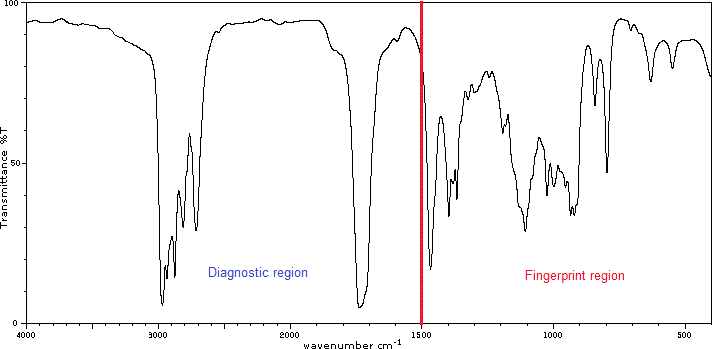
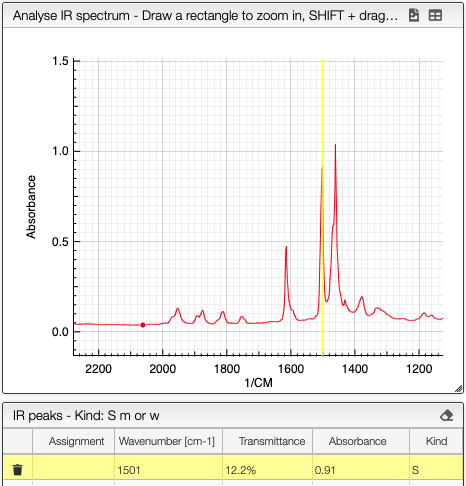
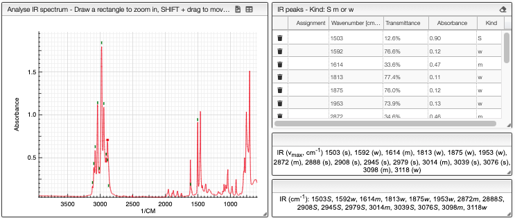
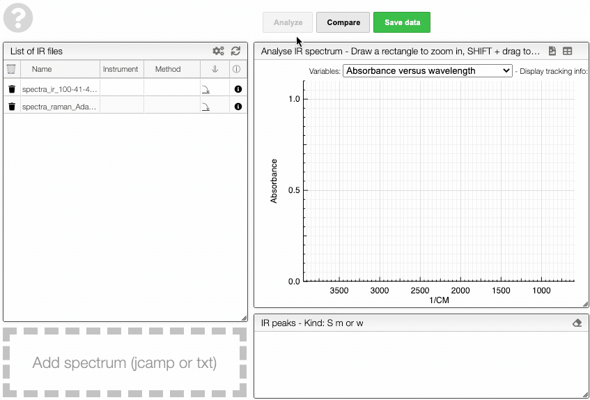

# Infrared spectra

<iframe width="560" height="315" src="https://www.youtube.com/embed/7iLuVpt5IXc" title="YouTube video player" frameborder="0" allow="accelerometer; autoplay; clipboard-write; encrypted-media; gyroscope; picture-in-picture" allowfullscreen></iframe>

## Introduction

[Infrared spectroscopy (IR)](https://en.wikipedia.org/wiki/Infrared_spectroscopy) is a spectroscopic technique dealing with the infrared region of the electromagnetic spectrum (wavelengths between 700 nm and 1 mm). It is widely used to characterize and study chemicals. The IR spectrum can be visualized in a graph of infrared light absorbance or transmittance (%) with respect to the frequency or wavelength given in wavenumber (cm⁻¹). Infrared spectroscopy exploits the fact that molecules absorb specific frequencies of light characteristic of their structure. The absorption occurs at the resonant frequency which corresponds to the vibrational frequency of the molecule, associated to a particular normal mode of motion and bond type.

## Upload and view the spectra

In this view there are different ways to [upload an IR spectrum](../includes/upload/README.md) in either a [JCAMP](../includes/jcamp/README.md) or a text file format.

Once the spectrum is uploaded you can visualize it by clicking on its name and [manipulate it](../includes/manipulate/README.md).

:::tip Switch between absorbance and transmittance

When loading an IR spectrum, the application is aware if it was acquired in transmittance or absorbance mode. If you want to switch between the two modes, you may click on the toggle icon shown below.

The application will remember your preferred mode for the next time.

:::

:::caution
Don't forget to `Save data` before leaving the page!
:::

## Peak picking

It is possible to [manually pick peaks](../includes/peakpick/README.md) on an infrared spectrum by holding down the ALT key, and then left-clicking on the peaks of interest.

The application will systematically look for the strongest signal close to the wavelength that has been clicked.

The peak will then be displayed under **IR peaks**.

Alternatively, the system allows to perform [peak picking automatically](../includes/autopick/README.md) within a certain range and signal-to-noise ratio.

The signal strength is given automatically. The categorization `S`, `m` and `w` is done automatically based on the highest and lowest selected peak.

All peak wavenumbers and intensities are reported in a compact format ready for publication.

## Comparing

You can compare multiple IR spectra by first opening up an IR spectrum, and then clicking `Compare` on top of the IR spectrum.

After which, under **List of selected entries**, you can choose the other molecule which has the spectrum that you would like to compare. Then choose the IR spectrum you would like to be plotted under **List of IR spectra**. (check animation below)

The spectra will then be both displayed on top of each other. You can also freely [hide selected graphs and change the color](../includes/showhide/README.md) by clicking the color bar.

## Preprocessing

Filters can be applied on the spectra allowing to [adjust the view, to rescale and to modify the baseline](../includes/preprocessing/README.md).

For instance, centering the mean and dividing by the standard deviation is a common practice in the IR spectra. This can be performed by successively applying the `Center Mean` and the `Divide by SD` filters.
