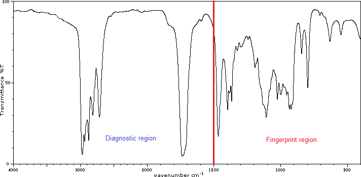

# Infrared Spectroscopy

[Infrared spectroscopy (IR)](https://en.wikipedia.org/wiki/Infrared_spectroscopy) is a spectroscopic technique dealing with the infrared region of the electromagnetic spectrum (wavelengths between 700 nm and 1 mm). It is widely used to characterize and study chemicals. The IR spectrum can be visualized in a graph of infrared light absorbance or transmittance (%) with respect to the frequency or wavelength given in wavenumber (cm⁻¹). Infrared spectroscopy exploits the fact that molecules absorb specific frequencies of light characteristic of their structure. The absorption occurs at the resonant frequency which corresponds to the vibrational frequency of the molecule, associated to a particular normal mode of motion and bond type.

