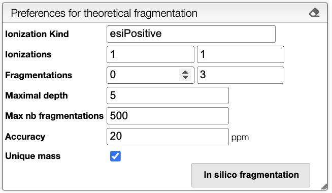
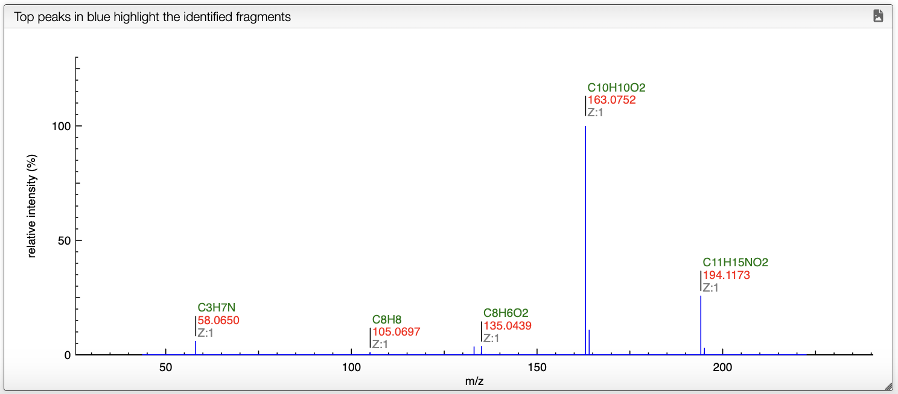
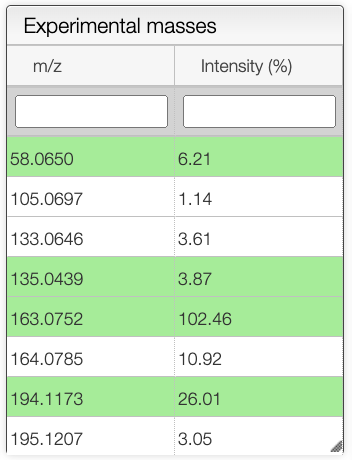
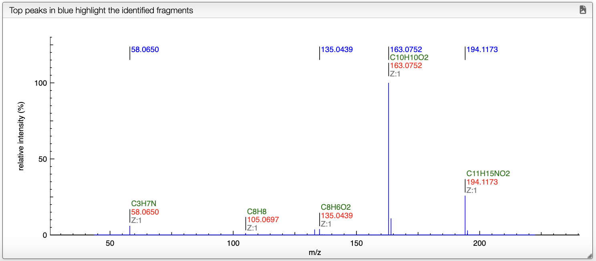

# Fragmentation

This tool is an *in silico* fragmentation tool for small molecules. It uses a database of known fragmentation patterns to predict the most likely fragmentation pattern for a given molecule. 

## Preferences

To compute the *in silico* fragmentation, the user needs to provide parameters in the left panel.

It is possible to choose the following parameters:

- **Ionization Kind**: Kind of ionization, currently only `esiPositive` is supported.
- **Ionizations**: Range of ionizations to consider. The default is `1-1`.
- **Fragmentations**: Number of fragmentation mask to apply. The default is `0-3`.
- **Maximum depth**: Maximum depth of the fragmentation tree. The default is `5`.
- **Max nb fragmentations**: Maximum number of reactions to consider. The default is `500`.
- **Accuracy**: Accuracy in the mass in ppm. The default is `20`.
- **Unique mass**: If checked, only unique masses are considered. The default is `true`.

Once all the parameters are set, the user can select a spectrum in the spectrum panel. If there is no spectrum, the user can upload one by drag and dropping a file in panel that is below the spectrum panel.

When a spectrum is selected, it will automatically be show in the bottom panel, and processed to label the peaks with the molecular formula associated. This annotation is based on the molecular formula of the molecule drawn in the bottom left panel.

## Fragmentation

The fragmentation is computed by clicking on the `In silico fragmentation` button. The fragmentation tree is shown in the top panel. 

The resulting tree presents the initial molecule ionized, and the possible fragments of the molecule. The fragments are computed by applying a set of fragmentation reactions rules to the molecule from a database, that is accessible in the `Reactions` button on the top. The rules are applied recursively until the maximum depth is reached. It is important to note that only the fragments that have a mass that corresponds to a peak in the mass spectrum are kept. The intensity of the color of the fragments in the tree corresponds to the intensity of the peak in the spectrum, white meaning no peak, and pink the most intense peak. The tree can be exported as `svg` by clicking on the export button on the top right of the view.

In the experimental masses panel, green cells correspond to the fragments that have been attributed to a peak in the spectrum. 

On the spectrum, the blue annotations correspond to the fragments that have been attributed to a peak.

When the mouse is over a peak, the corresponding fragment is highlighted in the right panel view. Once a peak is clicked, the mass difference between all the other peaks is shown on the spectrum.

