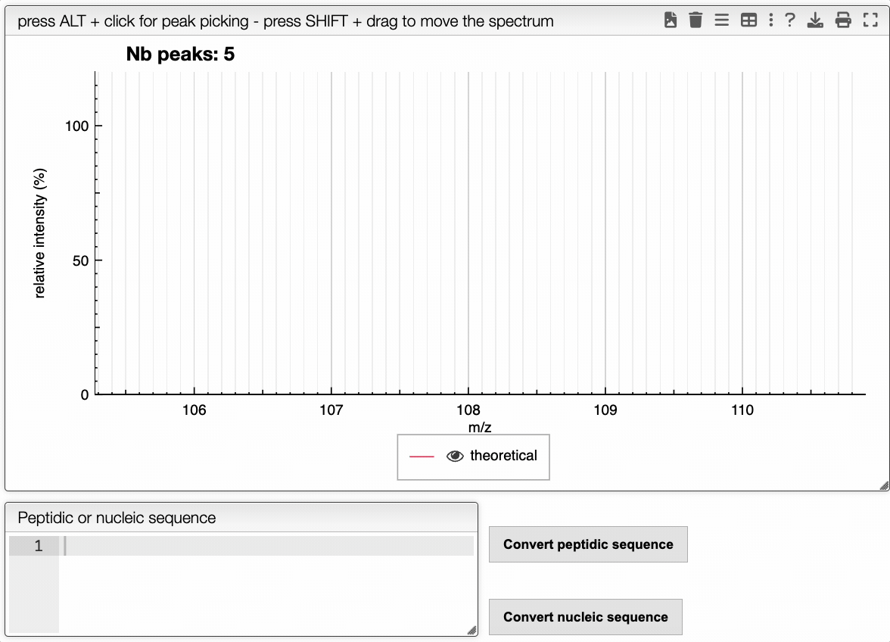
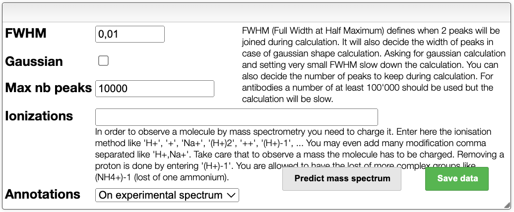
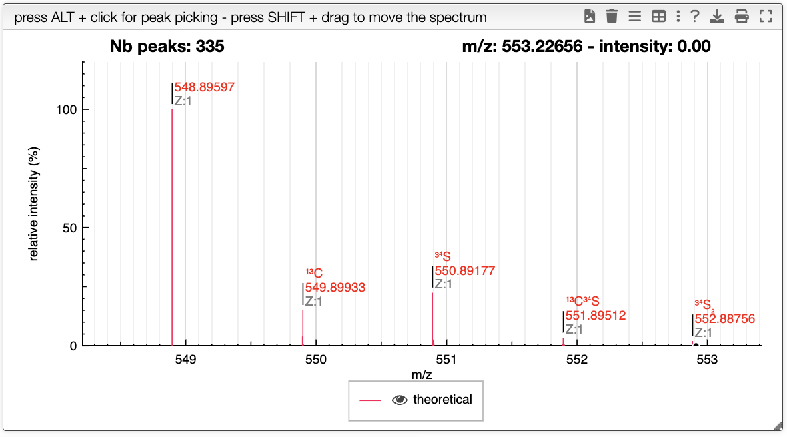
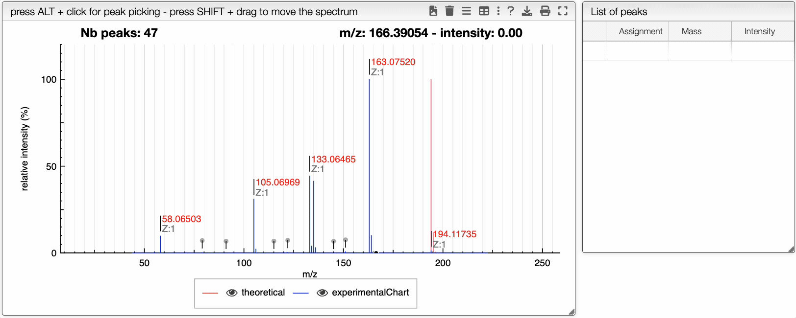

## Introduction

This view allows to simulate a high resolution mass spectrum from a molecular formula. It can also be used to get the HR mass spectrum of a peptidic or nucleic sequence.

## HR mass 

It is possible to predict the mass spectrum of a molecule, by either drawing it on the left panel, entering the molecular formula, or from the peptidic or nucleic sequence that can be entered in the corresponding area. Another possibility is to copy and paste a part of a `pdb` file that contains a sequence, this part will be automatically parsed and the sequence will be extracted.

The spectrum is then predicted according to the settings given in the upper panel. In the settings, it is possible to modify :

- **FWHM** : the full width at half maximum of the peaks can be adjusted.
- **Gaussian** : enable or not a Gaussian peak shape.
- **Max nb peaks** : specify the maximum number of peaks.
- **Ionizations** : specify a single or multiple ionizations.
- **Annotation** : show the annotations on the experimental spectrum or the theoretical spectrum.

The spectrum can be predicted by clicking on the `Predict mass spectrum` button. It is also possible to save all data.

In the case where the FWHM is set to zero, and the peaks are non-Gaussian, if the annotation is `on theoretical spectrum`, the system will show the isotope that correspond to each peak.

## Experimental spectrum

You can drag and drop experimental spectrum on the top right panel. If you click on one experimental spectrum, it will be loaded and displayed. On the spectrum, if you press `ALT` and click on a peak, this peak will be added on the table on the right. Once you added one peak, you can assign it to any text.

