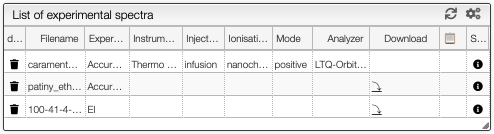
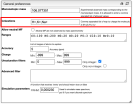
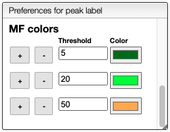
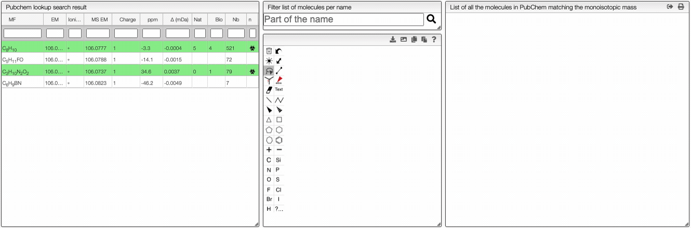
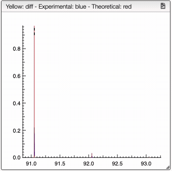
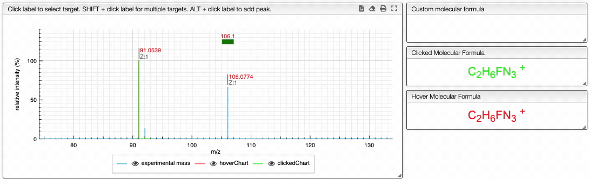

import Range from "../../../includes/range/README.md";
import TOCInline from '@theme/TOCInline'
import Assignment from './includes/assignment/README.md';
import Similarity from './includes/similarity/README.md';

<TOCInline toc={toc} />

# MF from monoisotopic mass

This tool is used to determine the molecular formula based of the monoisotopic mass.

## List of spectra

On the middle top panel, you can see the list of the imported experimental spectra. Each spectrum has a description if the data are available. You can see the type of `resolution` (either high or low resolution), the `instrument` used, the `ionisation` method and the `analyser`. It is also possible to download the data file and see the meta data associated.


## Preferences

### Entering a monoisotopic mass

When loading an experimental spectrum the tool will **automatically** make a peak picking (centroid) that will be displayed on the spectrum.

Zooming in the spectrum will progressively add more and more detailed peaks.

If you are searching the molecular formula of an unknown product you should **click** on the label corresponding to the monoisotopic experimental mass.


:::tip Many monoisotopic masses at once
It is possible to search for many monoisotopic masses at once. Simply `SHIFT` + click on other labels in order to have a comma separated list of monoisotopic mass.
:::

### Molecular formula from monoisotopic mass

This tool allows finding possible molecular formula for a specific observed monoisotopic mass. When the elements are part of `H, C, O, N, F, Cl, Br, I, Si, P and O` the monoisotopic mass corresponds to the peak of the isotopic distribution that has the lowest mass.

However, by mass we don't observe a monoisotopic mass directly but always $m/z$ of a charged form. The molecule may be charged positively, negatively, multicharged or also modified by the addition of protons or other charged entities.

This tool will consider the mass of the electron and the number of charge of the molecule.

### Ionizations

In order to observe a neutral molecule the mass spectrometer will charge it using different techniques. This may involve adding protons, remove electrons, etc.

You can also observe charged molecules resulting of the addition of Na<sup>+</sup>, K<sup>+</sup>, etc.

In order to evaluate all the possibilities you must enter in the 'ionizations' field a comma separated list of all the allowed ionizations.

:::info Syntax
You may as well specify multiple charges. Here are some examples of allowed patterns:

- H+ (addition a proton)
- H+, Na+, K+ (either a proton, sodium cation or potassium cation)
- H+, (H+)2, (H+)3 (addition of one, two or three protons)
- (H+)-1, (H+)-2, (H+)-3 (removal of one, two or three protons)

:::



:::tip Range of ionization
It is also allowed ot enter range of ionizations like
- (H+)1-5, adding between one and five protons
- (H+)-1--5, removing between one and five protons
:::

## Accuracy and charge

You can specify the accuracy in ppm and the charge of the target molecule using the corresponding input box.


## Range of atoms and groups

If some information about the molecule is known, you can specify it in the `Range` input. The allowed syntax is given bellow.

<Range/>

### Filter by degree of unsaturation

The result can be further filtered by the <a href="https://en.wikipedia.org/wiki/Degree_of_unsaturation" target="_blank">degree of unsaturation</a>.

For stable molecules the unsaturation degree is expected to be greater or equal to zero.
Moreover, if it is non-radical molecule the unsaturation degree is integer.


Please note that those filters apply on the molecular formula without the ionization.

### Advanced filtering

Based on a variable `entry` that has the following structure:

```json
{
  "em": 588.19603227909,
  "unsaturation": 1.5,
  "mf": "C14H34N7O18",
  "charge": 0,
  "ionization": {
    "mf": "(H+)2",
    "em": 2.01565006446,
    "charge": 2
  },
  "atoms": {
    "C": 14,
    "H": 34,
    "N": 7,
    "O": 18
  },
  "groups": {},
  "ms": {
    "ionization": "(H+)2",
    "em": 295.1052925918659,
    "charge": 2,
    "delta": 0.02253940813409372,
    "ppm": 76.37751236561516
  }
}
```

You need to return `true` or `false`. You are allowed to use all the javascript programming language.

Examples:

:::tip Less carbons than nitrogens

```js
if (entry.atoms.C < entry.atoms.N) return true;
```

:::

:::tip Nitrogens must be even

```js
return entry.atoms.N % 2 === 0;
```

:::


:::tip Small observed mass should be double charged

```js
if (entry.ms.em > 300 && entry.charge === 1) return true;
if (entry.ms.em < 300 && entry.charge === 2) return true;
```

:::

### Relative mass and MF determination

This view displays normally the mass of the peaks, but it is also possible to display relative mass to a specific peak.

1. Click on a peak to change the `Monoisotopic mass` value
2. Click on the checkbox `Relative mass` on the top right


It is also possible to display possible molecular formulas for the relative mass. Those are calculating using the following criteria:

- allowed atoms are based on the `Ranges`
- only neutral loss are considered
- the charge of the entity loosing this neutral fragment is defined in `Charge`, by default 1
- you should select `Show MF` in order to annotate the peaks with the corresponding MF

It is also possible to define the color of the MF annotation depending on the precision. By default, if no MF is found under a precision of 20ppm no MF is displayed.




## Results table

This tool calculates on-the-fly the possible molecular formula based on a monoisotopic mass and possible ionizations.

The resulting table will contain green background lines if this molecular formula exists in PubChem. This is an excellent way to find plausible molecular formula of unknown products.


The results contain various columns:

- the NON-IONIZED molecular formula
- the monoisotopic mass of the NON-IONIZED molecule
- the unsaturation degree
- the ionization
- the observed mass
- the total charge (with ionization)
- the error in mDa
- the absolute value of the error in ppm

## Pubchem candidates

Using the button `Pubchem candidates` you are able to list all the possible molecular formula that yields to the desired monoisotopic mass with the defined precision. The right column will redirect you to the corresponding PubChem web page.


Couple of points to note:

- PubChem does not provide the isotope information in the molecular formula
- PubChem does not provide the different parts of the molecule in the molecular formula
- PubChem is not consistent with the monoisotopic mass they list on their website

Therefore we have recalculated the molecular formula, monoisotopic mass, charge and molecular weight from the provided molfile. This allows us to have very accurate monoisotopic mass that also deals with isotopes.

Please note that for the calculation of the monoisotopic mass we didn’t consider the charge !

NB: only stable isotopes are considered!

## Tips

<Assignment/>

<Similarity/>


## Info

The simulated spectrum is calculated using a regression of the width of the peaks as a function of the mass.


# PubChem

In this panel, you can estimate the molecular formula even if you don't know the range of atoms. When the spectrum is loaded, you can click on a peak and the system will show a list of the possible molecular formula for a given ionization and accuracy. On the table you can see in green the molecular formula that are registered in the PubChem database. If you click on a formula, you can see at the right the list of isomers. In the draw panel, you can make a substructure search or a name search within the list. 



In the table you can also see the number of **natural product** (`Nat`) and **bioactive** (`Bio`) molecule with the same molecular formula. If you click on the  icon, you can see a table with the publication in PubMed related to the natural or bioactive product. Moreover, using **MeSH** terms, you can filtrate the results in the search bar at the top.


# Similarity

For a low resolution spectrometer, this tool will calculate the similarity of each peak using the [similarity](includes/similarity/README.md) parameters. For each proposition of the molecular formula, you can see on the right the graph with the theoretical and the experimental value. Here we can see in red the predicted value and in blue the experimental.



You can also specify a molecular formula and simulate it as following:



# All peaks

This module will analyze all the peaks and calculate the error with respect to the predicted spectrum of each molecular formula. 

