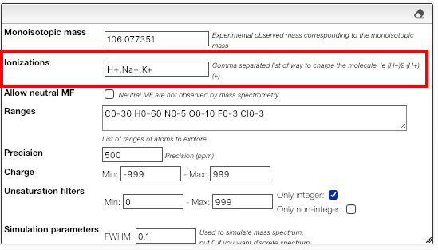
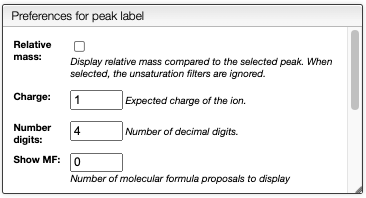
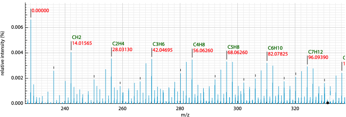

# MF from monoisotopic mass

## Preferences

### Entering a monoisotopic mass

When loading an experimental spectrum the tool will automatically make a peak picking (centroid) that will be displayed on the spectrum.

Zooming in the spectrum will progressively add more and more detailed peaks.

If you are searching the molecular formula of an unknown product you should click on the label corresponding to the monoisotopic experimental mass.

### Molecular formula from monoisotopic mass

This tool allows finding possible molecular formula for a specific observed monoisotopic mass. When the elements are part of H, C, O, N, F, Cl, Br, I, Si, P and O the monoisotopic mass corresponds to the peak of the isotopic distribution that has the lowest mass.

However, by mass we don’t observe a monoisotopic mass directly but always a charged form. The molecule may be charged positively, negatively, multicharged or also modified by the addition of protons or other charged entities.

This tool will consider the mass of the electron and the number of charge of the molecule.

### Ionizations

In order to observe a neutral molecule the mass spectrometer will charge it using different techniques. This may involve adding protons, remove electrons, etc.

You can also observe charged molecules resulting of the addition of Na+, K+, etc.

In order to evaluate all the possibilities you must enter in the 'ionizations' field a comma separated list of all the allowed ionizations.

You may as well specify multiple charges. Here are some examples of allowed patterns:

- H+ (addition a proton)
- H+, Na+, K+ (either a proton, sodium cation or potassium cation)
- H+, (H+)2, (H+)3 (addition of one, two or three protons)
- (H+)-1, (H+)-2, (H+)-3 (removal of one, two or three protons)

### Filter by degree of unsaturation

The result can be further filtered by the <a href="https://en.wikipedia.org/wiki/Degree_of_unsaturation" target="_blank">degree of unsaturation</a>.

For stable molecules the unsaturation degree is expected to be greater or equal to zero.
Moreover, if it is non-radical molecule the unsaturation degree is integer.

Please note that those filters apply on the molecular formula without the ionization.

### Relative mass and MF determination

This view displays normally the mass of the peaks, but it is also possible to display relative mass to a specific peak.

1. Click on a peak to change the `Monoisotopic mass` value
2. Click on the checkbox `Relative mass` on the top right

It is also possible to display possible molecular formulas for the relative mass. Those are calculating using the following criteria:

- allowed atoms are based on the `Ranges`
- only neutral loss are considered
- the charge of the entity loosing this neutral fragment is defined in `Charge`, by default 1
- you should select `Show MF` in order to annotate the peaks with the corresponding MF

It is also possible to define the color of the MF annotation depending on the precision. By default, if no MF is found under a precision of 20ppm no MF is displayed.

## Results table

This tool calculates on-the-fly the possible molecular formula based on a monoisotoipc mass and possible ionizations.

The resulting table will contain green background lines if this molecular formula exists in PubChem. This is an excellent way to find plausible molecular formula of unknown products.

The results contain various columns:

- the NON-IONIZED molecular formula
- the monoisotopic mass of the NON-IONIZED molecule
- the unsaturation degree
- the ionization
- the observed mass
- the total charge (with ionization)
- the error in mDa
- the absolute value of the error in ppm

## Pubchem candidates

Using the button ‘Pubchem candidates’ you are able to list all the possible molecular formula that yields to the desired monoisotopic mass with the defined precision.

Couple of points to note:

- PubChem does not provide the isotope information in the molecular formula
- PubChem does not provide the different parts of the molecule in the molecular formula
- PubChem is not consistent with the monoisotopic mass they list on their website

Therefore we have recalculated the molecular formula, monoisotopic mass, charge and molecular weight from the provided molfile. This allows us to have very accurate monoisotopic mass that also deals with isotopes.

Please note that for the calculation of the monoisotopic mass we didn’t consider the charge !

NB: only stable isotopes are considered!

##Tips

:::tip Assignment
It is possible to assign the different fragments. More information can be [found here](includes/assignment/README.md).
:::

:::tip Similarity
In order to improve the MF determination it is possible to compare the full isotopic distribution. More information can be [found here](includes/similarity/README.md).
:::
