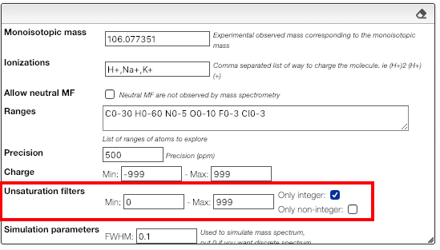
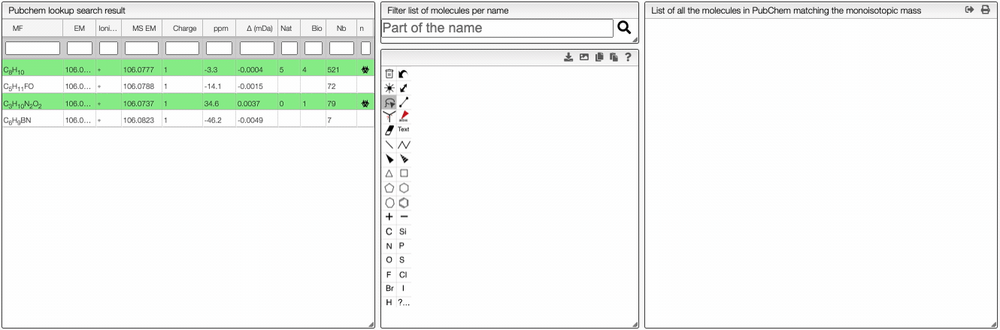

import Range from "../../../includes/range/README.md";
import TOCInline from '@theme/TOCInline'
import Assignment from './includes/assignment/README.md';
import Similarity from './includes/similarity/README.md';
import Taxonomy from '../../../includes/taxonomy/README.md';
import PeakLabels from '../includes/peak-labels/README.md';

<TOCInline toc={toc} />

# OctoChemDB: MF / structure from mass spectra

This very generic tool tries to identify molecular formulas and possibly chemical structures from mass spectra. It can deal with completely unknown products, for which the elements that compose the molecule are unknown, to products for which the range of molecular formulas is known.

In the case of unknown products, the tool will rely on OctoChemDB, a database created specifically to retrieve information on compounds from the monoisotopic mass.

## What is OctoChemDB ?

OctoChemDB combines 10 databases available for free on the internet and combine them based on the chemical structure (without stereochemistry). It in then indexed based on the molecular formula and monoisotopic mass. From the monoisotopic mass it can then retrieve all related information like available experimental spectra, taxonomy, biological activity, PubMed articles and patents.

The following 10 databases are combined on a regular base.

- [PubChem](https://pubchem.ncbi.nlm.nih.gov/)
- [PubMed](https://pubmed.ncbi.nlm.nih.gov/)
- [Lotus](https://lotus.naturalproducts.net/)
- [Coconut](https://coconut.naturalproducts.net/)
- [CMAUP](https://www.bidd.group/CMAUP/)
- [GNPS](https://gnps.ucsd.edu/)
- [NP Atlas](https://www.npatlas.org/)
- [MassBank](https://massbank.eu/MassBank/)
- [NCBI Taxonomies](https://www.ncbi.nlm.nih.gov/taxonomy)

A public API is available on: [https://octochemdb.cheminfo.org/documentation/](https://octochemdb.cheminfo.org/documentation/) and the GitHub repository is available [here](https://github.com/cheminfo/octochemdb).

You can check [here](https://www.cheminfo.org/?viewURL=https%3A%2F%2Fcouch.cheminfo.org%2Fcheminfo-public%2Faf1777ba7596df3b8b2bc64d3d609cda%2Fview.json&loadversion=true) the status of the aggregation database.

## Homepage

This tool is used to determine the molecular formula based of the monoisotopic mass.

### List of spectra

On the middle top panel, you can see the list of the imported experimental spectra. Each spectrum has a description if the data are available. You can see the type of `resolution` (either high or low resolution), the `instrument` used, the `ionisation` method and the `analyser`. It is also possible to download the data file and see the meta data associated.


### Preferences

#### Entering a monoisotopic mass

When loading an experimental spectrum the tool will **automatically** make a peak picking (centroid) that will be displayed on the spectrum.

Zooming in the spectrum will progressively add more and more detailed peaks.

If you are searching the molecular formula of an unknown product you should **click** on the label corresponding to the monoisotopic experimental mass.


:::tip Many monoisotopic masses at once
It is possible to search for many monoisotopic masses at once. Simply `SHIFT` + click on other labels in order to have a comma separated list of monoisotopic mass.
:::

#### Molecular formula from monoisotopic mass

This tool allows finding possible molecular formula for a specific observed monoisotopic mass. When the elements are part of `H, C, O, N, F, Cl, Br, I, Si, P and O` the monoisotopic mass corresponds to the peak of the isotopic distribution that has the lowest mass.

However, by mass we don't observe a monoisotopic mass directly but always $m/z$ of a charged form. The molecule may be charged positively, negatively, multicharged or also modified by the addition of protons or other charged entities.

This tool will consider the mass of the electron and the number of charge of the molecule.

#### Ionizations

In order to observe a neutral molecule the mass spectrometer will charge it using different techniques. This may involve adding protons, remove electrons, etc.

You can also observe charged molecules resulting of the addition of Na<sup>+</sup>, K<sup>+</sup>, etc.

In order to evaluate all the possibilities you must enter in the 'ionizations' field a comma separated list of all the allowed ionizations.

:::info Syntax
You may as well specify multiple charges. Here are some examples of allowed patterns:

- H+ (addition a proton)
- H+, Na+, K+ (either a proton, sodium cation or potassium cation)
- H+, (H+)2, (H+)3 (addition of one, two or three protons)
- (H+)-1, (H+)-2, (H+)-3 (removal of one, two or three protons)

:::


:::tip Range of ionization
It is also allowed to enter range of ionizations like

- (H+)1-5, adding between one and five protons
- (H+)-1--5, removing between one and five protons
  :::

### Accuracy and charge

You can specify the accuracy in ppm and the charge of the target molecule using the corresponding input box.


### Range of atoms and groups

If some information about the molecule is known, you can specify it in the `Range` input. The allowed syntax is given bellow.

<Range/>

#### Filter by degree of unsaturation

The result can be further filtered by the <a href="https://en.wikipedia.org/wiki/Degree_of_unsaturation" target="_blank">degree of unsaturation</a>.

For stable molecules the unsaturation degree is expected to be greater or equal to zero.
Moreover, if it is non-radical molecule the unsaturation degree is integer.



Please note that those filters apply on the molecular formula without the ionization.

#### Advanced filtering

Based on a variable `entry` that has the following structure:

```json
{
  "em": 588.19603227909,
  "unsaturation": 1.5,
  "mf": "C14H34N7O18",
  "charge": 0,
  "ionization": {
    "mf": "(H+)2",
    "em": 2.01565006446,
    "charge": 2
  },
  "atoms": {
    "C": 14,
    "H": 34,
    "N": 7,
    "O": 18
  },
  "groups": {},
  "ms": {
    "ionization": "(H+)2",
    "em": 295.1052925918659,
    "charge": 2,
    "delta": 0.02253940813409372,
    "ppm": 76.37751236561516
  }
}
```

You need to return `true` or `false`. You are allowed to use all the javascript programming language.

Examples:

:::tip Less carbons than nitrogens

```js
if (entry.atoms.C < entry.atoms.N) return true;
```

:::

:::tip Nitrogens must be even

```js
return entry.atoms.N % 2 === 0;
```

:::

:::tip Small observed mass should be double charged

```js
if (entry.ms.em > 300 && entry.charge === 1) return true;
if (entry.ms.em < 300 && entry.charge === 2) return true;
```

:::

<PeakLabels/>

### Results table

This tool calculates on-the-fly the possible molecular formula based on a monoisotopic mass and possible ionizations.

The resulting table will contain green background lines if this molecular formula exists in PubChem. This is an excellent way to find plausible molecular formula of unknown products.


The results contain various columns:

- the NON-IONIZED molecular formula
- the monoisotopic mass of the NON-IONIZED molecule
- the unsaturation degree
- the ionization
- the observed mass
- the total charge (with ionization)
- the error in mDa
- the absolute value of the error in ppm

On the right of the results table you have the possibility to show the registered Pubchem molecules by clicking on the  icon. There is also a way to find more about the Pubchem candidates by clicking on the search icon , this button will redirect you to the Pubchem panel.

Moreover, it is possible to **search molecular formula that are included in the original molecular formula**. To do this, click on the  icon. Depending on what was defined in the `preferences for peak label` panel, this tool will show the possible molecular formula for each peak. You can choose the range of atoms in the molecular formula that you want in the preferences panel.

### Pubchem candidates

Using the button `Pubchem candidates` you are able to list all the possible molecular formula that yields to the desired monoisotopic mass with the defined precision. The right column will redirect you to the corresponding PubChem web page.


Couple of points to note:

- PubChem does not provide the isotope information in the molecular formula
- PubChem does not provide the different parts of the molecule in the molecular formula
- PubChem is not consistent with the monoisotopic mass they list on their website

Therefore we have recalculated the molecular formula, monoisotopic mass, charge and molecular weight from the provided molfile. This allows us to have very accurate monoisotopic mass that also deals with isotopes.

Please note that for the calculation of the monoisotopic mass we didn’t consider the charge !

NB: only stable isotopes are considered!

### Tips

<Assignment/>

<Similarity/>

### Info

The simulated spectrum is calculated using a regression of the width of the peaks as a function of the mass.


## PubChem

This tool allows to find a molecular formula, even if we don't know the range of atoms that compose the molecule. A few assumptions are made: the charge of the non ionized molecule is null, there are at least 5 molecules that have the same MF and the molecule does not break apart.

When the spectrum is loaded, you can click on a peak and the system will show a list of the possible molecular formula for a given ionization and accuracy. On the table you can see in green the molecular formula that are registered in the PubChem database. If you click on a formula, you can see at the right the list of isomers. In the draw panel, you can make a substructure search or a name search within the list.



In the table you can also see the number of **natural product** (`Nat`) and **bioactive** (`Bio`) molecules with the same molecular formula. If you click on the  icon, you can see a table with the publication in PubMed related to the natural or bioactive product. Moreover, using **MeSH** terms, you can filtrate the results in the search bar at the top.

<Taxonomy/>

The other icon  appears when there are experimental spectra from the GNPS database. If you click on this icon, you will be able to compare your spectrum with spectra of molecules that have the same molecular formula from real experiments. You can change experimental spectra using the arrows in you keyboard.


In the table on the top you can see the list of available spectra. For each spectrum, there are information about the ion source, the instrument used to make the measure, the precursor, the ionization, the mode and the export icon redirects you to the original web page where the spectrum comes from. You can also see the similarity between your spectrum and the ones from the GNPS database. Your spectrum as well as the selected experimental spectra are plotted in a head to tail plot.

In the left text entry boxes, you can select the number of peaks that you want to see as well as the accuracy that you allow when comparing with the experimental spectrum from the database. The mass power and intensity power are a way to make either the mass or the intensity more important when comparing with the experimental spectrum. The higher is a power, the more important becomes the information (intensity or mass). The similarity between two spectra is calculated based on the [cosine similarity](https://github.com/cheminfo/mass-tools/blob/52e7fde163bbbf4c0fb8987154ee33be890ed481/packages/ms-spectrum/src/MSComparator.js).

On the bottom left panel, you can select any experimental spectrum that was imported.

## Similarity

For a low resolution spectrometer, this tool will calculate the similarity of each peak using the **similarity** parameters. For each proposition of the molecular formula, you can see on the right the graph with the theoretical and the experimental value. Here we can see in red the predicted value and in blue the experimental.


You can also specify a molecular formula and simulate it as following:


## Fragments

This view is used to determine potential peaks due to the fragmentation of the molecule. The filter will be looking for subpart of the main molecule.

On the left panel, you can select the type of ionization as well as the accuracy (in ppm) between the experimental mass and the theoretical mass.


If you click on a peak, the system will show you on the middle table the potential molecular formula, depending on the accuracy that you provided. For instance, in the case of ethyl benzene with an accuracy of 50 ppm, it will show 3 molecular formula corresponding to the monoisotopic mass.

You can search within the table using the white cell on the top of each column. It is possible to filter by charge, unsaturation, exact mass...


Once you clicked on a possible molecular formula, the system will be looking for monoisotopic masses of subpart of the main molecule and show them on the right table. In this example, the system found 5 possible fragments and show the charge, the MF, the ionization as well as the difference in ppm with the experimental peak.


## All peaks

This module will analyze all the peaks and calculate the error with respect to the predicted spectrum of each molecular formula.

## Mass DB search

Experimentally, it is not impossible that the sample is oxidized, a methyl group is added ... This tool will allow you to select peaks and search molecules that have the same fragments in a database.


In the `preference` panel, you can customize the search by specifying the number of peaks and the desired accuracy in ppm. Additionally, in the `modification` text entry, you can make changes to the molecular formula such as adding O, which will prompt the system to consider the possibility of an additional oxygen in the molecule. In the resulting table, you can see the structure of the relevant molecules, the type of modification that was considered, the similarity with respect to the experimental spectrum as well as the link to the GNPS database.
