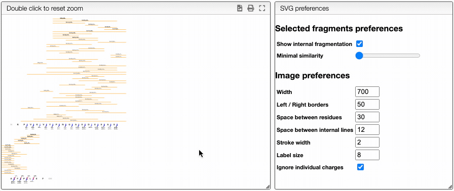
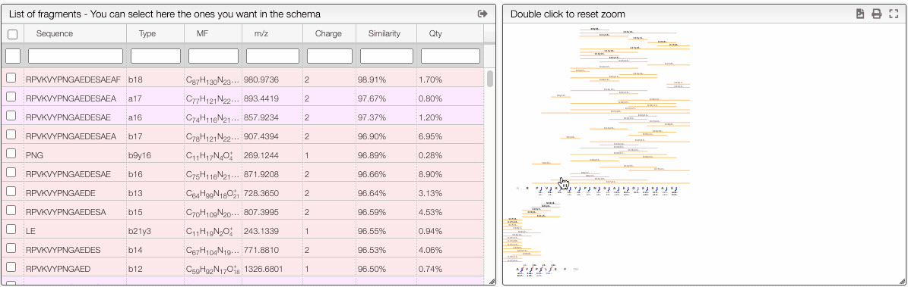

# Analyze high resolution mass spectra for peptides and nucleotides

## Introduction

This tool allows analyzing complex mass spectra of polynucleotide or protein/peptide that may involve digestion, adducts, residue modification, etc.

Please use a recent version of Google Chrome !!!

## Importing experimental data

This tool can be either used in a LIMS or stand-alone. In the stand-alone mode you should either drag/drop your experimental spectrum as a tab-delimited text file or copy and paste it (`CTRL`-V) while moving you mouse over the drop zone.

The list of available spectra will be displayed in the table, and you may click on one of them to display it.

## Parameters

### Ionizations

All the results are shown for the neutral molecule, and it is therefore necessary to specify the ionization method. The methods may be entered as a comma separated list of all the allowed ionizations.

You may as well specify multiple charges. Here are some examples of allowed patterns:

- H+ (addition a proton)
- H+, Na+, K+ (either a proton, sodium cation or potassium cation)
- H+, (H+)2, (H+)3 (addition of one, two or three protons)
- (H+)-1, (H+)-2, (H+)-3 (removal of one, two or three protons)

It is also allowed to enter a range

- (H+)1-10 (addition of one to 10 protons)
- (H+)-1--10 (removal of one to 10 protons)

## Nucleic and peptidic sequence

There are various possibilities to enter a peptidic sequence

## One letter code

`AAAHHHCCCKK`

A sequence may be entered as a one letter code. By default the system will add on the N-terminal side an hydrogen
`H` and on the C-terminal side a `OH`.

N or C terminal modifications should be entered between parenthesis. For example if you have an amide function on
the C-terminal you should enter `AAAHHHCCCKK(NH2)`.

It is also possible to have side chain modifications by adding the modification after the one letter amino acid between parenthesis.

Examples:

- `AAAC(S-1Se)GGG`: the sulfur of a cysteine is replace by a selenium (`S-1`, we remove a sulfur, `Se` we add a selenium)
- `AAA(H-1Cl)GGG`: we replace the hydrogen of an alanine by a chlorine
- `AAAS(PO3H)`: we have a phosphorylated serine

## Three letter code

Sequence may be entered as a 3 letter code. In this case lowercase / uppercase has to be respected and N and C terminal groups must be specified.

Examples:

- `HAlaGlyProOH`
- `MeAla(Se)GlyNH2`
- `(CH3)Ala(Se)GlyNH2`

## Report

The `report` tab allows to create a dynamic image that shows the various fragmentation observed in the case of peptidic and nucleic sequences.

It is a vectorial format (SVG) suitable for publication and preferences allows to define various rendering parameters.

There are also 2 ways to filter the displayed fragments

### Dynamically filter fragment

The more visual way is based on interactive preferences that allows to show / hide internal fragments as well as to select the minimal similarity and minimal quantity of the fragments to display.

### Filtering from the table

From the table is it also possible to make queries per column. In order to display only the selected fragments you need to click on the top of the select column. It is also possible to select couple of fragments to display.

