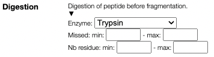
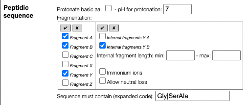
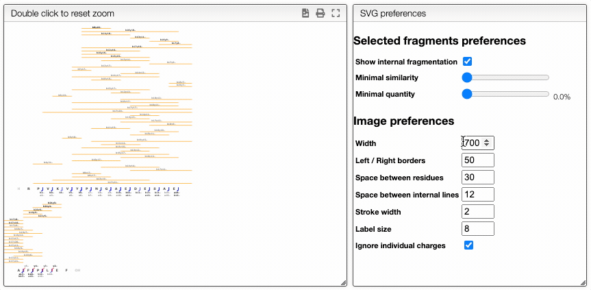
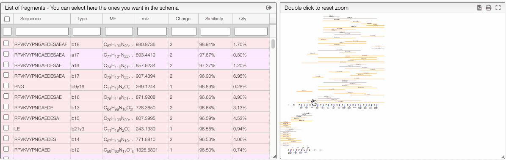

# Analyze high resolution mass spectra of complex mixtures

## Introduction

This tool allows analyzing complex mass spectra of complex mixtures including polynucleotide or protein/peptide that may involve digestion, adducts, residue modification, etc.

## Importing experimental data

This tool can be either used in a LIMS or stand-alone. In the stand-alone mode you should either drag/drop your experimental spectrum as a tab-delimited text file or copy and paste it (`CTRL`-V) while moving you mouse over the drop zone.


The list of available spectra will be displayed in the table, and you may click on one of them to display it.


## Parameters

### Ionizations

All the results are shown for the neutral molecule, and it is therefore necessary to specify the ionization method. The methods may be entered as a comma separated list of all the allowed ionizations.

You may as well specify multiple charges. Here are some examples of allowed patterns:

- H+ (addition a proton)
- H+, Na+, K+ (either a proton, sodium cation or potassium cation)
- H+, (H+)2, (H+)3 (addition of one, two or three protons)
- (H+)-1, (H+)-2, (H+)-3 (removal of one, two or three protons)

It is also allowed to enter a range

- (H+)1-10 (addition of one to 10 protons)
- (H+)-1--10 (removal of one to 10 protons)

## Mixture

This tool allows to generate possible molecular formula based on the MF range.

The tool is a combination of all the lines and for each line one molecular formula will be used. If there are many possibilities you can separate on each line the molecular formula using a comma. Moreover you can define ranges of molecular formula.

Example:

```
H (CH2CH2O)0-2 OH, H (CH2CH2S)0-2 SH
H-1Me, H-1Ph,
```

The first line will define 6 possible molecular formula. The second line means remove an hydrogen followed by adding a Me or Ph. Please note the ending comma that means that there be also no modification.

We can then also allow many ionizations like for example `H+, Na+` and the following table will be obtained:

| First part    | Second part | Ionization | MF Mass   | m/z      |
| ------------- | ----------- | ---------- | --------- | -------- |
| HOH           |             | H+         | H2O       | 19.0178  |
| HOH           | H-1 Me      | H+         | CH4O      | 33.0335  |
| HOH           |             | Na+        | H2O       | 40.9998  |
| HOH           | H-1 Me      | Na+        | CH4O      | 55.0154  |
| H(CH2CH2O)OH  |             | H+         | C2H6O2    | 63.0441  |
| H(CH2CH2O)OH  | H-1 Me      | H+         | C3H8O2    | 77.0597  |
| H(CH2CH2S)OH  |             | H+         | C2H6OS    | 79.0212  |
| H(CH2CH2O)OH  |             | Na+        | C2H6O2    | 85.026   |
| H(CH2CH2S)OH  | H-1 Me      | H+         | C3H8OS    | 93.0369  |
| HOH           | H-1 Ph      | H+         | C6H6O     | 95.0491  |
| H(CH2CH2O)OH  | H-1 Me      | Na+        | C3H8O2    | 99.0417  |
| H(CH2CH2S)OH  |             | Na+        | C2H6OS    | 101.0032 |
| H(CH2CH2O)2OH |             | H+         | C4H10O3   | 107.0703 |
| H(CH2CH2S)OH  | H-1 Me      | Na+        | C3H8OS    | 115.0188 |
| HOH           | H-1 Ph      | Na+        | C6H6O     | 117.0311 |
| H(CH2CH2O)2OH | H-1 Me      | H+         | C5H12O3   | 121.0859 |
| H(CH2CH2O)2OH |             | Na+        | C4H10O3   | 129.0522 |
| H(CH2CH2S)2OH |             | H+         | C4H10OS2  | 139.0246 |
| H(CH2CH2O)OH  | H-1 Ph      | H+         | C8H10O2   | 139.0754 |
| H(CH2CH2O)2OH | H-1 Me      | Na+        | C5H12O3   | 143.0679 |
| H(CH2CH2S)2OH | H-1 Me      | H+         | C5H12OS2  | 153.0402 |
| H(CH2CH2S)OH  | H-1 Ph      | H+         | C8H10OS   | 155.0525 |
| H(CH2CH2S)2OH |             | Na+        | C4H10OS2  | 161.0065 |
| H(CH2CH2O)OH  | H-1 Ph      | Na+        | C8H10O2   | 161.0573 |
| H(CH2CH2S)2OH | H-1 Me      | Na+        | C5H12OS2  | 175.0222 |
| H(CH2CH2S)OH  | H-1 Ph      | Na+        | C8H10OS   | 177.0345 |
| H(CH2CH2O)2OH | H-1 Ph      | H+         | C10H14O3  | 183.1016 |
| H(CH2CH2O)2OH | H-1 Ph      | Na+        | C10H14O3  | 205.0835 |
| H(CH2CH2S)2OH | H-1 Ph      | H+         | C10H14OS2 | 215.0559 |
| H(CH2CH2S)2OH | H-1 Ph      | Na+        | C10H14OS2 | 237.0378 |

## Nucleic and peptidic sequence

There are various possibilities to enter a peptidic sequence

## One letter code

`AAAHHHCCCKK`

A sequence may be entered as a one letter code. By default the system will add on the N-terminal side an hydrogen
`H` and on the C-terminal side a `OH`.

N or C terminal modifications should be entered between parenthesis. For example if you have an amide function on
the C-terminal you should enter `AAAHHHCCCKK(NH2)`.

It is also possible to have side chain modifications by adding the modification after the one letter amino acid between parenthesis.

Examples:

- `AAAC(S-1Se)GGG`: the sulfur of a cysteine is replace by a selenium (`S-1`, we remove a sulfur, `Se` we add a selenium)
- `AAA(H-1Cl)GGG`: we replace the hydrogen of an alanine by a chlorine
- `AAAS(PO3H)`: we have a phosphorylated serine

## Three letter code

Sequence may be entered as a 3 letter code. In this case lowercase / uppercase has to be respected and N and C terminal groups must be specified.

Examples:

- `HAlaGlyProOH`
- `MeAla(Se)GlyNH2`
- `(CH3)Ala(Se)GlyNH2`

## Peptides

In the case of peptide it is also possible to `in-silico` digest the sequence and to specify the allowed missed cleavage and the minimal and maximal sequence length.



While the usual fragmenation ABCXYZ are allowed it is also possible to specify internal fragments like YA and YB.



This may lead to numerous sequences that will have to be processed and if you would like to focus on a part of the sequence you can use the "Sequence must contain" field. This allows to enter a string that have to be contain in the expanded sequence code !

This means that if you have a sequence `AGSTY` and would like to only process the fragments that contain the glycine you should enter in this field `Gly` or if you want only `ST` you should enter `SerThr`.

:::tip
`Sequence must contain` field also allows as value a regular expression. In this case you can enter something like `/ProVal|gly/i`.
You need to enter the `/` to specify it should be considered as a regular expression and you have the possibility to specify modifiers like in this case in which we want a case insensitive match (`i`).
:::

## Nucleotides

## Links

It is possible to create links inside the sequence of between sequence and variable groups. Links are defined using `#n` where `n` is a number. When generating all the possible molecular formula there should exactly 2 times each `#n` (or zero time) otherwise the MF is not valid.

You will find here after 2 examples.

### Cyclic peptides

You can enter as sequence:

AC(H-1#1)LLIIC(H-1#1)KK

For the 2 cytéines we remove a proton and we create a link between them.

### Variable modifications

If we have a cyclic peptide that is linked by a polyethylene glycol of variable number of units we can enter:

- sequence: AC(H-1#1)LLIIC(H-1#2)KK
- variable groups: #1(CH2CH2O)1-10#2,

In order to be a valid molecular formula the #1 and #2 have either to be absent (zero occurence) or present twice. This is especially useful in peptide fragmentation.

## Report

The `report` tab allows to create a dynamic image that shows the various fragmentation observed in the case of peptidic and nucleic sequences.

It is a vectorial format (SVG) suitable for publication and preferences allows to define various rendering parameters.

There are also 2 ways to filter the displayed fragments

### Dynamically filter fragment

The more visual way is based on interactive preferences that allows to show / hide internal fragments as well as to select the minimal similarity and minimal quantity of the fragments to display.



### Filtering from the table

From the table is it also possible to make queries per column. In order to display only the selected fragments you need to click on the top of the select column. It is also possible to select couple of fragments to display.


