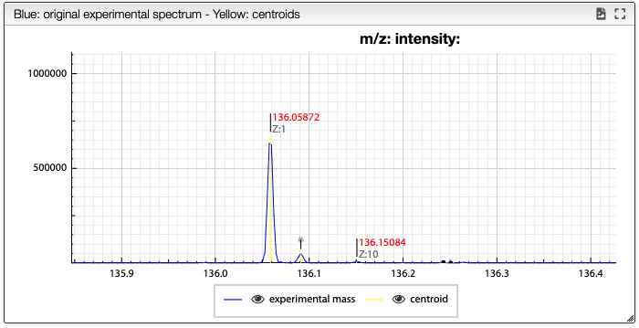
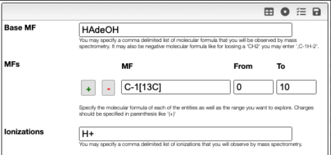
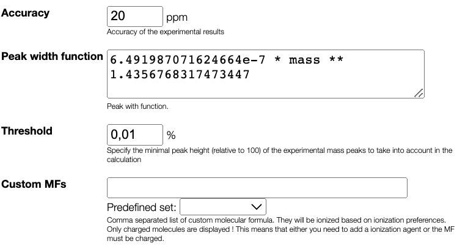
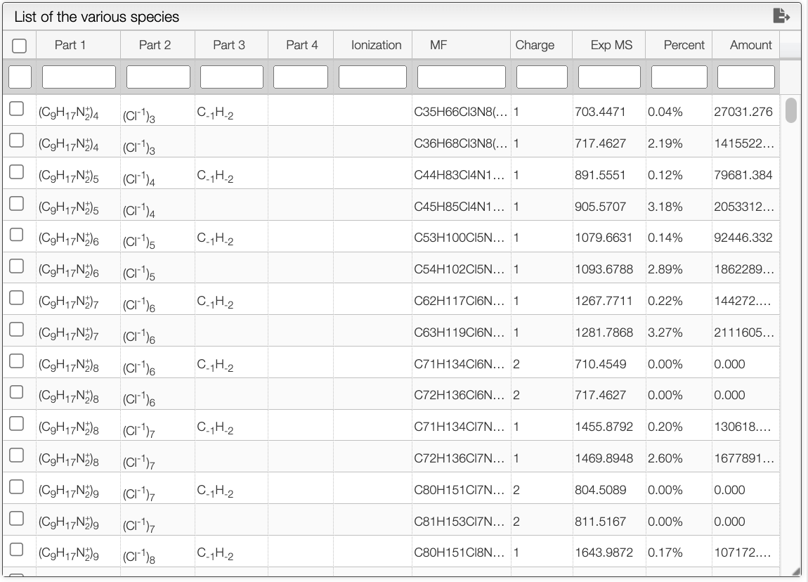

import MFFilter from '../includes/filter-mf/README.md'

# Mass spectra deconvolution

A mass spectrum is often complex and difficult to interpret, particularly when it contains multiple overlapping peaks or when there are uncertainties in the mass calibration.
Mass spectra deconvolution is a computational technique that aims to extract meaningful information from a mass spectrum by separating the overlapping peaks and identifying the underlying species that give rise to the observed peaks. This can be achieved by comparing the observed mass spectrum to theoretical models of the expected isotopic distributions of the species in the sample.
The tool takes as input a mass spectrum and generates all the theoretical isotopic distributions of all entities to look for. It then aligns the theoretical isotopic distribution to the centroids.

The workflow is the following:

- Make a peak picking (centroids) of the mass spectrum
- Generate all the theoretical isotopic distribution of all entities to look for
- Align the theoretical isotopic distribution to the centroids
- Calculate a non-negative matrix factorization
- Create a report

## Peak picking

When loading the spectrum a peak picking is done that determine the position and width of all the peaks based on global spectrum deconvolution algorithm that was implemented in [JavaScript](https://github.com/mljs/global-spectral-deconvolution).

The result of the peak picking appears in the spectrum as yellow vertical lines. Note that the top of the peak is determined based on the 3 highest point and does not have to match an experimental point.

## Define possible MFs

When trying to deconvolute a mass spectrum it is required to define all the possible molecular formula. It is important to limit as much as possible the number of molecular formula to consider.

The molecular formula is defined based on:

- `Base MF` : atoms that are common and present in all the molecular formula
- `Modifications` : list of modifications that can be applied on the `Base MF`
  - if you want to search for isotopic enrichment you can enter as MF: `C-1[13C]`, a modification in which we remove a `C` of natural abundance and add a 13C
- `Ionizations` : define the list of ways to ionize the molecule. If the molecule is naturally charted this field may stay empty. It can also contain an unlimited comma separated list of ionizations like `Na+, K+, NH4+, H+,`. Note this comma at the end that allows also to have no ionization.

<MFFilter />

## Mass spectrum parameters

Peak width calculation is done automatically and allows to predict the peak width based on the mass. 
In the `peak width function` box, you can find the predicted function of the width of the peaks depending on the mass.

## Results table

After configuring the parameters, you can initiate the deconvolution process by clicking the `Analyse the data` button. The tool utilizes the [non-negative matrix factorization algorithm](https://github.com/mljs/nmf) to perform the deconvolution. The results of the deconvolution will be displayed in table panel on the right.

The table contains all the possible combinations of species to arise at the experimental spectra. It provides information such as their molecular formula, charge, and product intensity in percentage. The table can be filtered by clicking on the headers or by entering filters in the white text boxes.

You can export the table as a `txt` file by clicking on the  button. Once a row is selected, you can find a summary on the bottom right panel that include the composition found as well as the observed mass.

The blue spectrum displayed at the bottom represents the reconstructed spectrum, while the composition selected in the results table is shown in red.

