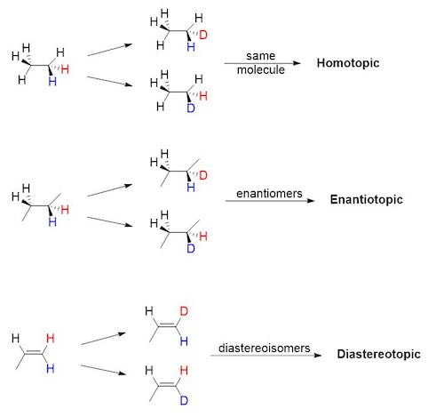
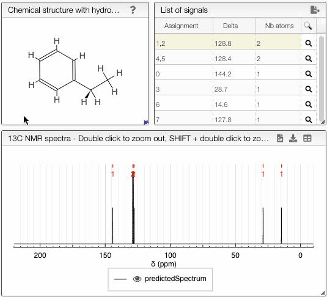

# Homotopic, enantiotopic and diastereotopic atoms

When two seemingly equivalent atoms are attached to the same nucleus (e.g. two protons attached to the same carbon), they can be in three different relationships with respect to each other: [**homotopic**, **enantiotopic** and **diastereotopic**](https://en.wikipedia.org/wiki/Topicity).

These relationships are important when considering reactions which replace hydrogens with other atoms (e.g. Br, D) or when analyzing these molecuels with NMR.

## Homotopic

Homotopic groups in a compound are equivalent groups: two groups are homotopic if the molecule remains the same when the groups are interchanged with some other atom. Homotopic atoms are always identical, in any environment. 

## Enantiotopic

Enantiotopic groups correspond to groups in a molecule which, if one or the other were replaced, would generate a chiral compound. The two resulting compounds would be enantiomers. 

## Diastereotopic

Diastereotopic groups correspond to groups in a molecule which, if one or the other were replaced, would generate diastereoisomers. 

:::tip How can you recognize the relationship between groups?

In order to determine the relationship between two atoms, you must first label them with color (see image below). Then, replace blue and red atoms in turn with a different atom. If the resulting molecules are the same, the two atoms are homotopic.If the molecules are enantiomers, the atoms are enantiotopic. If the molecules are diastereoisomers, the atoms are diastereotopic. 

:::

The diastereotopicity is indicated in the views containing the chemical structure of your molecule with hydrogens exploded. Chirality is automatically provided in the site of interest. Moving the mouse over the hydrogens and carbons in the molecule, the equivalent ones will be highlighted. 

