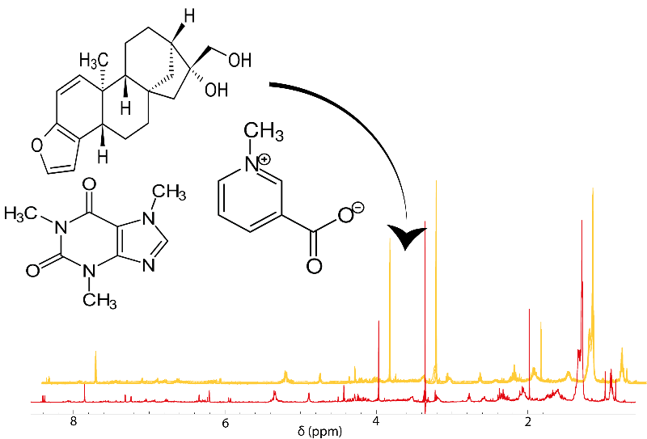

# NMR dataset generator

This tool is designed to build artificial 1H NMR datasets from your own library of molecules. This can be useful for identifying metabolites or developing new statistical methods. The current version allows you to generate a dataset from any file in `.mol` or `.sdf` format, define the number of categories and the population for each, assign a concentration distribution (or use default ones) to each molecule, and add artificial noise.

