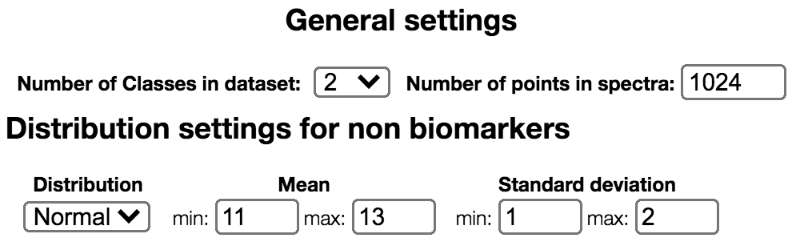

## Define resolution, categories, and the default distribution

Choose the number of points for the generated spectra, the number of classes to simulate and the range for the mean and the standard deviation of concentration for metabolites in the dataset:

These settings will be applied to all the generated spectra and used for each molecule, unless specified otherwise. To make the configuration easier for large sets of molecules, a default value is applied to all compounds. In the next section, these settings may be modified for each metabolite, if necessary.
