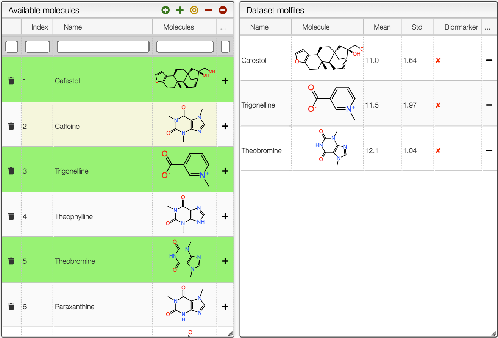

## Select the metabolites to be part of the dataset

The `Available molecules` window will highlight in green the molecules that are part of the current dataset.

The buttons at the top of the window allow you to:

-  add all available molecules to be part of the dataset.
-  add selected molecules to the current dataset.
-  set the selected molecules as the dataset.
-  remove selected molecules from the current dataset.
-  remove all molecules from the dataset.
