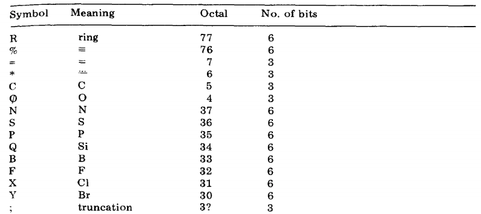
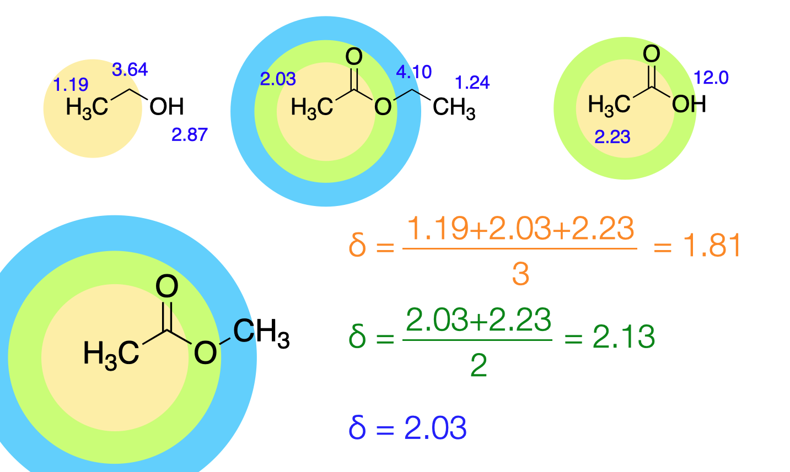

:::tip HOSE

    

    What is the HOSE code.
    

    

## HOSE code

The HOSE (Hierarchically Ordered Spherical Environment) code describes the environment of individual atoms spherically. The environment of a particular atom is described in the form of a string of characters. The priority rules and necessary syntax have been outlined in the [original paper](https://doi.org/10.1016/S0003-2670(01)83100-7) in 1978.
For instance, here are some symbols.

The prediction of the signal due to each individual atom is done by considering the chemical environment of the atom by layers like onion peels. See the following example.

The HOSE code is based on [nmrshiftdb](https://nmrshiftdb.nmr.uni-koeln.de/). 

:::
