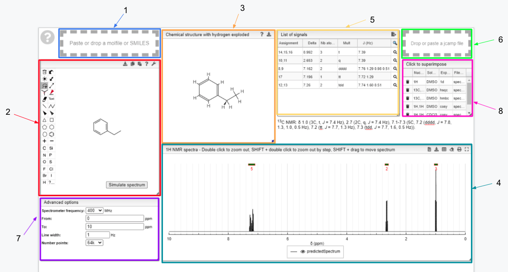

# 13C prediction

This tool allows you to predict the 13C NMR spectrum of your sample or any other molecule.

:::info Overview

1. Drag and drop module - paste a molfile or a SMILES string of a molecule
2. Draw a chemical structure and predict module - draw the structure of the molecule
3. Chemical structure with explicit hydrogens module - explicit representation of hydrogens in a molecule
4. 13C NMR spectrum module - predicted 13C spectrum of the chosen molecule
5. Signal module - list of obtained peaks and the corresponding chemical shifts
6. Drag and drop module - paste a JCAMP of an experimental spectrum for comparison

:::

The structure of the currently selected sample will be already drawn so that you may go ahead and simulate its spectrum right away. If you wish to simulate the spectrum of another molecule, you can draw it or you can paste the structure in the form of a molfile or a SMILES string. Structure drawing is powered by [JSME](http://peter-ertl.com/jsme/). You may also drop or paste a [JCAMP file](../../../includes/jcamp/README.md) to superimpose an experimental spectrum over the prediction.

The simulated spectrum, the chemical structure with explicit hydrogens and the list of peaks modules are linked, so that hovering over an entry in the list will highlight the corresponding atom in the structure and the relevant peak in the spectrum.

NMR prediction is done with [NMRshiftDB](http://nmrshiftdb.nmr.uni-koeln.de/). It is an NMR database for organic structures and their spectra. Using this information, in conjunction with the principle of [HOSE](hose_code/hose_code.md) code, a machine learning model makes chemical shift predictions. 

  

