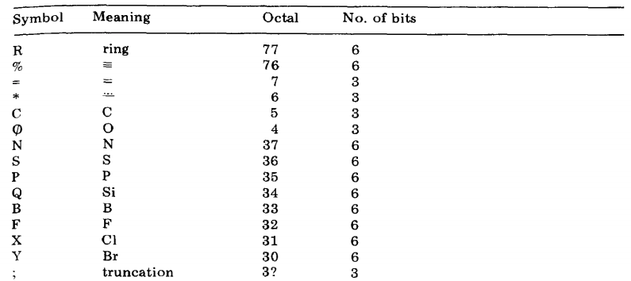
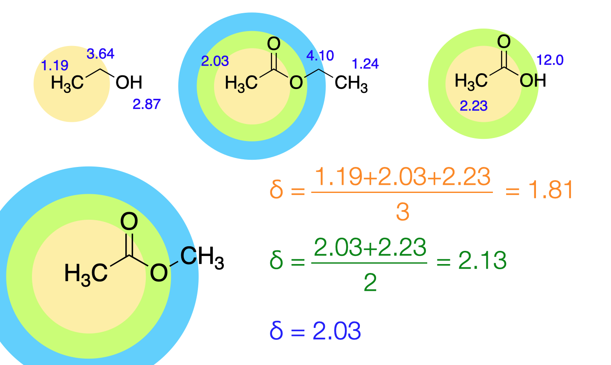

# HOSE code

The HOSE (Hierarchically Ordered Spherical Environment) code describes the environment of individual atoms spherically. The environment of a particular atom is described in the form of a string of characters. The priority rules and necessary syntax have been outlined in the original paper in 1978.

For instance, here are some symbols.

The prediction of the signal due to each individual atom is done by considering the environment in a spherical fashion. See the following example.

