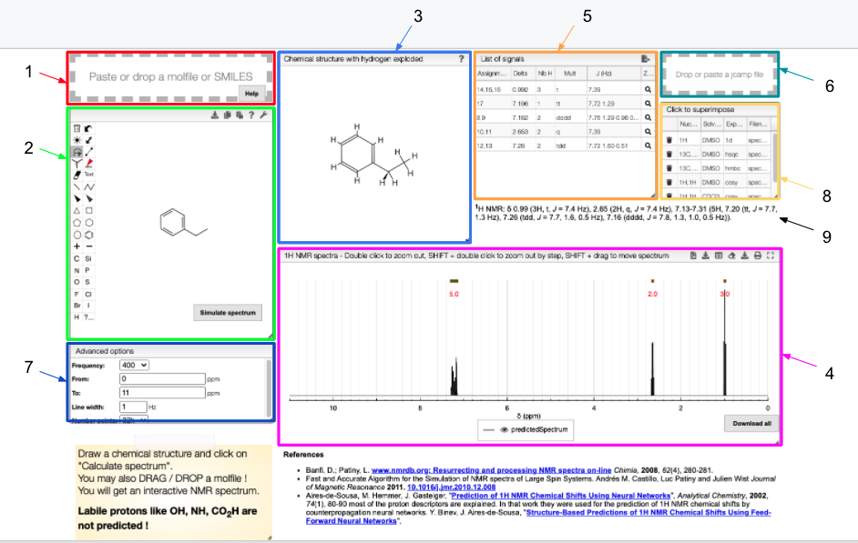

# 1H prediction

This tool allows you to predict the 1H NMR spectrum of your sample or any other molecule.

::: info Overview

1. Drag and drop module - paste a molfile or a SMILES string of a molecule
2. Draw a chemical structure and predict module - draw the structure of the molecule
3. Chemical structure with explicit hydrogens module - explicit representation of hydrogens in a molecule
4. 1H NMR spectrum module - predicted 13C spectrum of the chosen molecule
5. Signal module - list of obtained peaks and the corresponding chemical shifts
6. Drag and drop module - paste a JCAMP of an experimental spectrum for comparison
7. Advanced options module - modify the magnetic field strength, specify the range of chemical shifts, change line width and the number of points to plot.
8. List of spectra module - select which experimental spectra of the sample to superimpose on the predicted one
9. Peak list module - list of peaks with corresponding chemical shifts, scalar couplings and multiplicity, ready for publication.

:::

The structure of the currently selected sample will be already drawn so that you may go ahead and simulate its spectrum right away. If you wish to simulate the spectrum of another molecule, you can draw it or you can paste the structure in the form of a molfile or a SMILES string. Structure drawing is powered by [JSME](http://peter-ertl.com/jsme/). You may also drop or paste a JCamp to superimpose an experimental spectrum over the prediction.

The simulated spectrum, the chemical structure with explicit hydrogens and the list of peaks modules are linked, so that hovering over an entry in the list will highlight the corresponding atom in the structure and the relevant peak in the spectrum. Furthermore, the predicted spectrum is reported in the publication ready form (with chemical shifts, scalar couplings and peak multiplicity).

In the advanced options, you can adjust the parameters of the simulation. With frequency you can specify the strength of the magnetic field. Furthermore, you may adjust the range of chemical shifts in which to perform the simulation. Linewidth and number of points specify the peak width and the number of data points to simulate, respectively.

1H chemical shifts and coupling constants are predicted using [Spinus](http://www2.chemie.uni-erlangen.de/services/spinus/). Simulation from predicted parameters uses the method described in [DOI:10.1016/j.jmr.2010.12.008](http://www.sciencedirect.com/science/article/pii/S1090780710004003)

