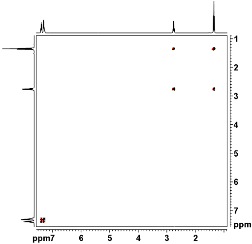

import Jcamp from '../../../includes/jcamp/README.md'

# COSY prediction

## Introduction 

This tool allows you to predict the COSY spectrum of your sample or any other molecule. [COSY (homonuclear correlation spectroscopy)](https://en.wikipedia.org/wiki/Two-dimensional_nuclear_magnetic_resonance_spectroscopy) is a two-dimentional nuclear magnetic resonance spectroscopic technique. It gives data plotted in a space defined by two frequency axes rather than one.  It is used to identify spins which are coupled to each other. 2-bond and 3-bond H-H coupling are visible by COSY, as well as long range coupling with long acquisition time. The cross-peaks (not on the diagonal) show scalar J-coupling correlations. This method is very useful when the multiplets overlap or when the second order coupling complicates the 1D spectrum. You can see below an example of COSY spectrum of ethylbenzene. 

The structure of the currently selected sample will be already drawn so that you may go ahead and click Calculate to calculate and simulate its COSY spectrum right away. If you wish to simulate the spectrum of another molecule, you can draw it or you can paste the structure in the form of a molfile or a SMILES string. Structure drawing is powered by [JSME](https://jsme-editor.github.io/). You may also drop or paste a **JCAMP-DX file** to superimpose an experimental spectrum over prediction.

<Jcamp/>

The simulated COSY spectrum, the 1H projection and the chemical structure with explicit hydrogens are linked, hovering over a peak in the spectrum will highlight the corresponding atoms in the structure and hovering over an atom will highlight the corresponding peaks in the spectrum.

1H chemical shifts and coupling constants are predicted using [Spinus](http://www2.chemie.uni-erlangen.de/services/spinus/). Simulation from predicted parameters uses the method described in [DOI:10.1016/j.jmr.2010.12.008](http://www.sciencedirect.com/science/article/pii/S1090780710004003). COSY correlations are calculated based on atom-to-atom paths in the molecule: a correlation is shown in the COSY whenever two hydrogens are joined by a path traversing no less than `Minimal number of bonds` and no more than `Maximal number of bonds`. You may adjust these Simulation parameters in the module right next to the `Calculate` button.  

