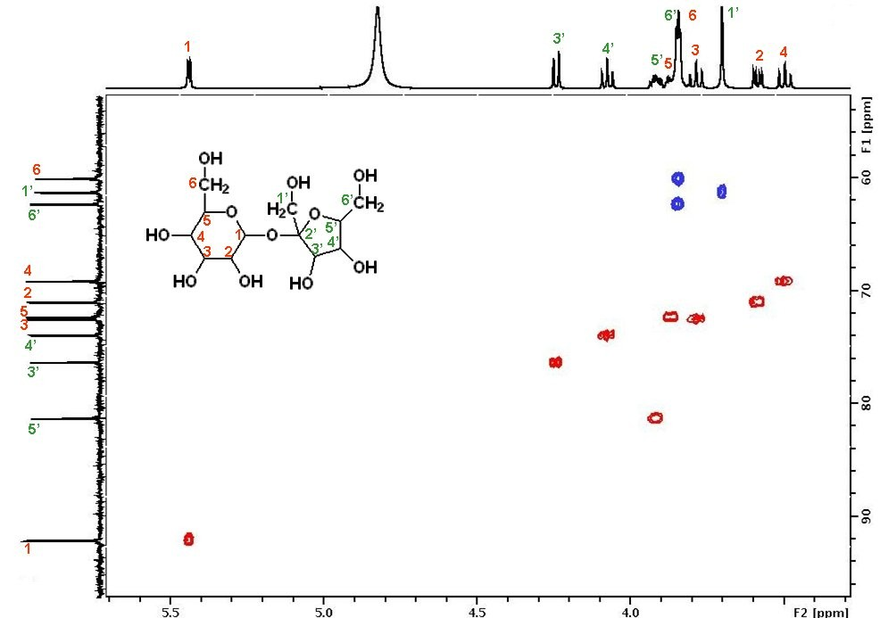

# HSQC / HMBC prediction

This tool allows you to predict the HSQC and HMBC spectrum of your sample or any other molecule. 
[HMBC (Heteronuclear Multiple-Bond Correlation spectroscopy)](https://nmr.chem.columbia.edu/content/hsqc-and-hmbc) is a 2D-NMR correlation experiment. Compared to COSY, which gives H-C-C-H proton correlations, this experiment gives connectivity information between carbons and protons that are separated by 2-4 bonds. Single bond correlations (i.e. correlations between C-H only) are often suppressed. This technique adds another dimension to the elucidation of molecular structure. You can see below an example of HSQC spectrum of sucrose. 

The structure of the currently selected sample will be already drawn so that you may go ahead and click `Calculate` to calculate and simulate its HMBC spectrum right away. If you wish to simulate the spectrum of another molecule, you can draw it or you can paste the structure in the form of a molfile or a SMILES string. Structure drawing is powered by [JSME](http://peter-ertl.com/jsme/). You may also drop or paste a [JCAMP file](../../../includes/jcamp/README.md) to superimpose an experimental spectrum over prediction.

The simulated HMBC spectrum, the 1H projection and the chemical structure with explicit hydrogens are linked, hovering over a peak in the spectrum will highlight the corresponding atoms in the structure and hovering over an atom will highlight the corresponding peaks in the spectrum.

1H chemical shifts and coupling constants are predicted using [Spinus](http://www2.chemie.uni-erlangen.de/services/spinus/). Simulation from predicted parameters uses the method described in [DOI:10.1016/j.jmr.2010.12.008](http://www.sciencedirect.com/science/article/pii/S1090780710004003). HMBC correlations are calculated based on atom-to-atom paths in the molecule: a correlation is shown in the HMBC whenever a hydrogen is joined by a path traversing no less than `Minimal number of bonds` and no more than `Maximal number of bonds` to the carbon atom. You may adjust these Simulation parameters in the module right next to the `Calculate` button. 

:::info HSQC spectrum  

A HSQC spectrum can be obtained by setting Maximal number of bonds and Minimal number of bonds to 1.  

:::

