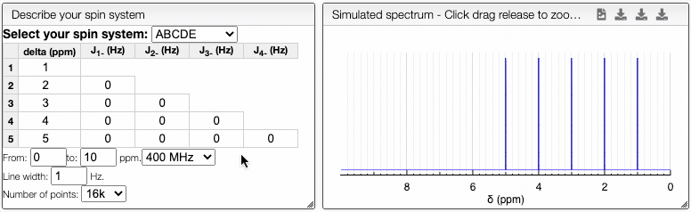

# Spin system

This tool is used to simulate second order J coupling effects that could modify 1D NMR spectra. It allows to predict and justify observed peak multiplicities.

:::note

It is not possible to compare the spin multiplicity prediction with experimental spectra.

:::

Start by selecting your spin system depending on the number of spins involved (ABC - three spins, ABDC - four spins...) and specify  their chemical shift (i.e. where they appear on your 1H spectra). Add the value of the coupling constant in between the spins of interest: J_i_(hz) corresponds to the coupling with the spin _i_. Finally, specify the parameters of the acquisition that could affect the peak definition (i.e. magnetic field strength, line width and the number of datapoints).

To compare several predictions, use the `Keep` button. It enables you to freeze the first prediction, whose spectrum becomes green. Coupling constants or chemical shifts can then be modified and the new spectra will overlap in blue.

