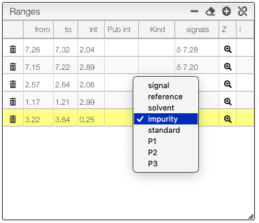

# Peak picking and assignment

:::info Overview

1. List of spectra that you can visualize
2. Spectra visualization
3. Structure of the molecule 
4. Information about the molecule: molecular weight and molecular formula 
5. Parameters: you can adjust the integration and remove impurities
6. List of signals and ranges
7. Information about a selected signal: you can adjust the value of the chemical shift 
8. J coupling constant edition 

:::

As you open the tab, the `Spectra` table will be filled with the spectra available for the selected sample. Selecting one will plot the corresponding NMR spectrum. You may choose to pick peaks manually or automatically.

:::note 

We recommend to use automatic peak picking and then modify the signals, using the `Ranges`, `Signals` and `J edition` tabs to modify the spectra. Integration is automatically computed upon defining the corresponding range and cannot be edited manually. You may edit the Pub int column on the Ranges table to fine-tune the integral values in the report.

:::

You will see the detected ranges and their integrals just to the right of the spectrum. Select a range to see a list of the associated peaks with their multiplicities and coupling constants. Adjust the table values (multiplicities, coupling constants and chemical shifts) according to your own criterion directly in the tabs. A publication-ready report of your peak picking is automatically generated below the Spectra table. 
 
:::caution
 
Don’t forget to Save your changes.

:::

To assign a peak select a range in the Ranges table and then select the nuclei to be assigned in the Structure. An icon  appears in the last column of the Ranges table showing that the peak has been assigned; click that icon to remove the assignment. Assigned nuclei are highlighted whenever the corresponding peak is selected in the NMR spectrum.

:::tip Define a specific range 

In the `Range` table, it is possible to define if a range is:

- signal: normal signal of the molecule
- reference (like TMS)
- solvent (like residual CHCl3)
- impurity
- standard
- P1: assignment of a minor product
- P2: assignment of a second minor product
- P3: assignment of a third minor product

bz double clicking on the signal of interest. Reference, solvent, impurity and standard will not be taken into account for the integral sum.

:::