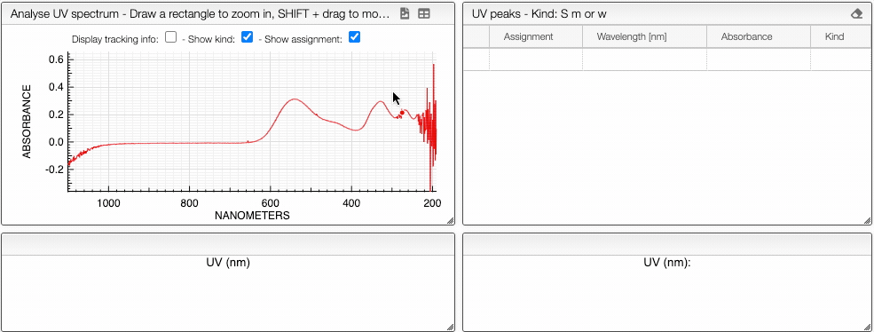
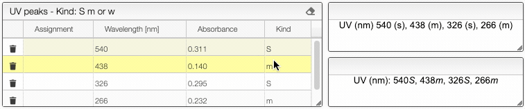
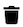
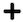
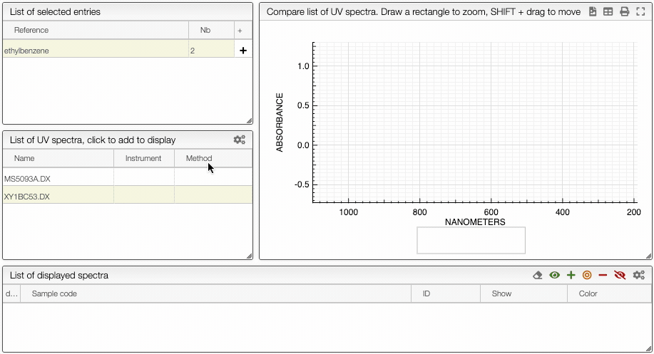

import CustomColumn from "../../includes/custumColumns/README.md";

# Ultraviolet spectra

## Introduction

[Ultraviolet-visible spectroscopy (UV-vis)](https://en.wikipedia.org/wiki/Ultraviolet%E2%80%93visible_spectroscopy) is a spectroscopic technique dealing with the visible and ultraviolet region of the electromagnetic spectrum (wavelengths between 100 and 700 nm). It measures the amount of light absorbed by or transmitted through a sample compared to a reference sample (blank). It is widely used in analytical chemistry for quantitative determination of different analytes. The UV-vis spectrum can be visualized in a graph of absorbance of light with respect to the wavelength (nm). UV-vis spectroscopy exploits the change of electronic states of a molecule due to light absorption at a specific frequency, characteristic to its structure.

## Analyze

### Upload and visualize spectra

In this view there are different ways to [upload a UV spectrum](../includes/upload/README.md) in either a [JCAMP](../includes/jcamp/README.md) or a text file format.

Once the spectrum is uploaded you can visualize it by clicking on its name and [manipulate it](../includes/manipulate/README.md).

:::caution
Don't forget to `Save data` before leaving the page!
:::

### Peak picking

It is possible to [manually pick peaks](../includes/peakpick/README.md) on an ultraviolet spectrum by holding down the ALT key, and then left-clicking on the peaks of interest.

The application will systematically look for the strongest signal close to the wavelength that has been clicked.

The peaks will be displayed in the `UV peaks`
tab. The signal strength is given automatically. The categorization `S`, `m` and `w` for strong, medium and weak, is based on the highest and lowest selected peak. All peak wavelenghts and absorbance are reported in a compact format ready for publication.

:::tip

You can edit the peak kind by double clicking on the kind in the peak table. The compact format of the peak list will automatically update.

:::

Alternatively, the system allows to perform [peak picking automatically](../includes/autopick/README.md) within a certain range and signal-to-noise ratio.

:::tip

You can remove a specific signal using the  icon or all the signals at the time using the  icon.

:::

## Compare

You can compare multiple UV spectra by first opening up a spectrum, and then clicking `Compare` on top of the UV spectrum.
After which, under **List of selected entries**, you can choose the other molecule which has the spectrum that you would like to compare. You can then add all the spectra attached to the molecule using the  icon by double clicking on the sample or display only one of the spectra by first clicking on the sample, then clicking on the specific spectrum in **List of UV spectra**. You can also use the  and icons to manage the view (check animation below).

The spectra will then be both displayed on top of each other. You can also freely [hide selected graphs and change the color](../includes/showhide/README.md) by clicking the color bar.

<CustomColumn/>
