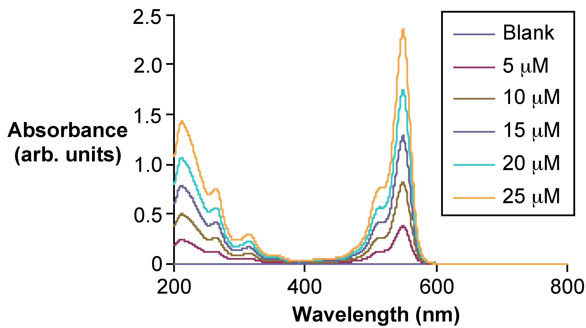

# Ultraviolet spectra

## Introduction

[Ultraviolet-visible spectroscopy (UV-vis)](https://en.wikipedia.org/wiki/Ultraviolet%E2%80%93visible_spectroscopy) is a spectroscopic technique dealing with the visible and ultraviolet region of the electromagnetic spectrum (wavelengths between 100 and 700 nm). It measures the amount of light absorbed by or transmitted through a sample compared to a reference sample (blank). It is widely used in analytical chemistry for quantitative determination of different analytes. The UV-vis spectrum can be visualized in a graph of absorbance of light with respect to the wavelength (nm). UV-vis spectroscopy exploits the change of electronic states of a molecule due to light absorption at a specific frequency, characteristic to its structure.

