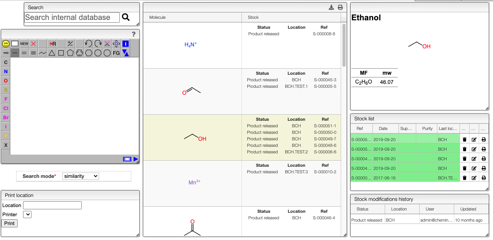

## Search inventory

Any sample may have `stock` information (location and status) and this view allows searching for those products by:

- substructure
- similarity
- location (i.e: `loc:BCH` for all samples having a location starting with `BCH`)
- any of the title or IUPAC names

