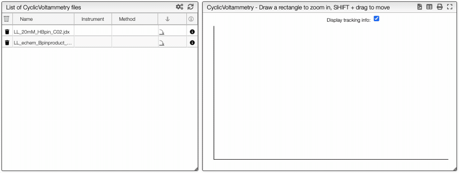
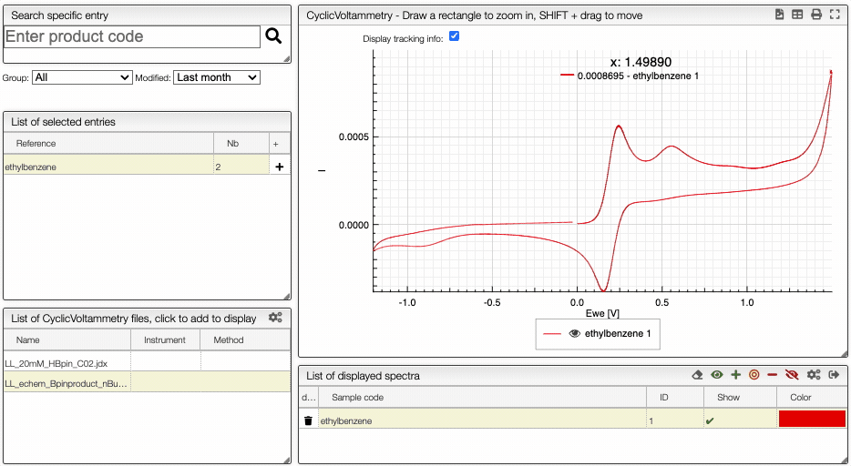

import CustomColumn from "../../includes/custumColumns/README.md";
import Upload from "../../30_structural_analysis/includes/upload/README.md";
import Preprocessing from "../../includes/preprocessing/README.md";

# Cyclic voltammetry 

## Introduction

[Cyclic voltammetry](https://en.wikipedia.org/wiki/Cyclic_voltammetry) is a type of potentiodynamic electrochemical measurement. A cyclic voltammetry graph is a graph of the current as a function of the potential. Both of these variables depend on time.

This tool allows the importation of data as a `txt` or a `JCAMP` file. 

## Upload a file

<Upload/>

If you click on an imported file, the spectrum is plotted on the middle panel as following. You can [manipulate](../../30_structural_analysis/includes/manipulate/README.md) it.

## Preprocessing

On the right panel, you can apply mathematical operations to the spectra with the preprocessing module.

<Preprocessing/>

## Compare spectra

You can compare multiple spectrum by clickling on the `Compare` button. It is then possible to [hide/show](../../30_structural_analysis/includes/showhide/README.md) spectra.

Learn more about cyclic voltametry: [10.1021/acs.jchemed.7b00361](https://dx.doi.org/10.1021/acs.jchemed.7b00361)

<CustomColumn/>
