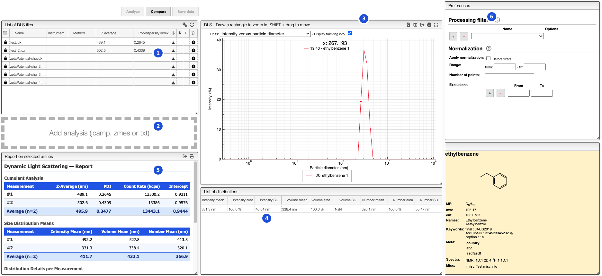

import CustomColumn from "../../includes/custumColumns/README.md";

# Dynamic Light Scattering

[Dynamic Light Scattering (DLS)](https://en.wikipedia.org/wiki/Dynamic_light_scattering), also known as photon correlation spectroscopy, is a technique used to measure the size distribution of particles in suspension or polymers in solution. It works by analyzing the fluctuations in the intensity of scattered laser light caused by the Brownian motion of particles. Smaller particles move faster and produce faster fluctuations, allowing the hydrodynamic diameter and polydispersity of the sample to be determined.

This module allows visualizing DLS measurements and generating statistical reports across multiple samples.

### Supported file formats

| Format | Extension | Description |
|--------|-----------|-------------|
| Zetasizer binary | `.zmes` | Native binary format from Malvern Panalytical Zetasizer instruments. Contains the full cumulant fit, all three distribution modes (intensity, volume, number), count rate, and instrument metadata. |
| Zetasizer text | `.txt` | Plain-text export from Malvern Panalytical Zetasizer instruments. |
| JCAMP-DX | `.jcamp`, `.dx` | Generic spectroscopy interchange format. |

## Upload

The file list (**1**) shows all DLS measurements attached to the current sample. New files can be uploaded by drag-and-drop onto the upload area (**2**) or pushed automatically from the instrument. Note that you can only upload files to samples to which you have write access.

## Visualization

To add measurements to the chart (**3**), click on the `+` next to a file in the list (**1**). The measurement will then appear in the chart panel from which you can control the visualization settings.

If you click on the color in a row, you can select any color you wish for the line.

In the chart you can draw a rectangle to zoom and double click to reset. You can move the graphs by pressing `SHIFT ⇧` while dragging them.

### Display units

The units selector controls which distribution is plotted on the chart:

- **Intensity versus particle diameter**: the intensity-weighted size distribution
- **Volume versus particle diameter**: the volume-weighted size distribution
- **Number versus particle diameter**: the number-weighted size distribution

The X axis (particle diameter) is displayed on a logarithmic scale in nanometres.

### Display tracking info

Enabling the **Display tracking info** checkbox shows the exact particle diameter value at the current mouse position directly on the chart.

## List of distributions

The distributions table (**4**) summarizes the key statistics for each distribution mode of the selected measurement:

| Column | Description |
|--------|-------------|
| Intensity mean / area / SD | Mean diameter, area under the curve, and standard deviation for the intensity distribution |
| Volume mean / area / SD | Same quantities for the volume distribution |
| Number mean / area / SD | Same quantities for the number distribution |

## Report

The report panel (**5**) aggregates data across selected measurements. **If no entries are selected, all loaded measurements are included in the report.**

### Cumulant Analysis

Summarizes the primary DLS result for each measurement and computes the average:

| Column | Description |
|--------|-------------|
| Z-Average (nm) | Intensity-weighted mean hydrodynamic diameter from the cumulant fit |
| PDI | Polydispersity index (0 = monodisperse, >0.5 = broadly polydisperse) |
| Count Rate (kcps) | Detected photon count rate in kilocounts per second |
| Intercept | Intercept of the correlation function (quality indicator, ideally close to 1) |

The **Average** row at the bottom shows the mean of all selected measurements.

### Size Distribution Means

Reports the mean diameter from each weighted distribution for every measurement:

| Column | Description |
|--------|-------------|
| Intensity Mean (nm) | Mean of the intensity-weighted distribution |
| Volume Mean (nm) | Mean of the volume-weighted distribution |
| Number Mean (nm) | Mean of the number-weighted distribution |

The **Average** row shows the mean across all selected measurements.

### Distribution Details per Measurement

Provides a full breakdown of each individual distribution peak for each measurement.

## Processing

The **Preferences** panel (**6**) on the right provides normalization and filtering options.

### Normalization

- **Apply normalization**: enable normalization of the spectra before display
- **Before filters**: apply normalization before or after the processing filters
- **Range**: restrict the X range (min / max particle diameter in nm) used for processing
- **Number of points**: resample the distribution to a fixed number of points. Useful for aligning spectra on the X axis, but only applicable to monotone data
- **Exclusions**: define X-axis zones to ignore during processing

<CustomColumn/>
