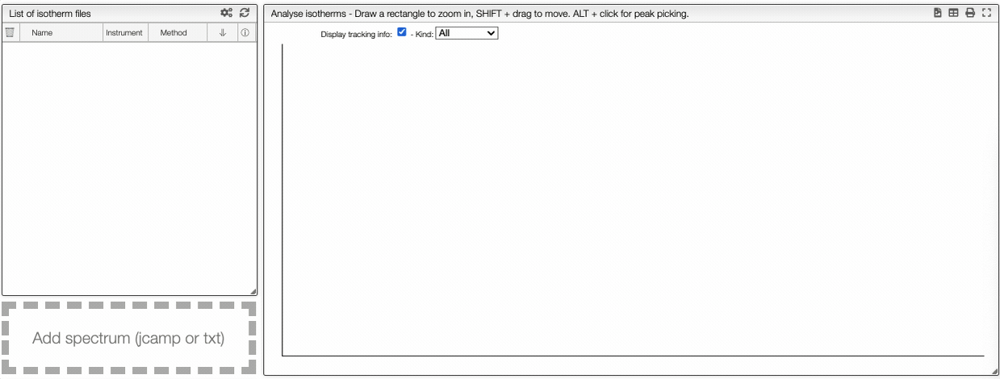
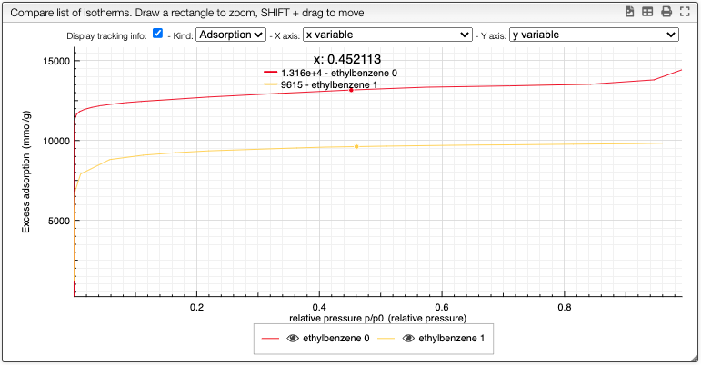

import DropDownMenu from "../../includes/dropdown_menu_graph/README.md";
import Preprocessing from "../../includes/preprocessing/README.md";
import Colors from '../../30_structural_analysis/includes/showhide/README.md';

# Isotherm analysis

## Introduction

**[Adsorption](https://en.wikipedia.org/wiki/Adsorption)** is a process of adhesion of atoms, ions or molecules on a surface. Desorption is the inverse process. There are two types of adsorption:

- [`Physisorption`](https://en.wikipedia.org/wiki/Physisorption): Atoms and molecules are trapped on the surface of solid due to attractive Van der Waals forces.
- [`Chemisorption`](https://en.wikipedia.org/wiki/Chemisorption): Adsorption that involves a chemical reaction between the surface and the absorbate (example : corrosion).

These adsorptions can be described by [adsorption isotherms](https://en.wikipedia.org/wiki/Adsorption#Single-molecule_explanation). If the adsorbate is a gas, its amount is plotted against its pressure, if it consists of a liquid phase solute, it is plotted as a function of the concentration. In both cases, the process occurs at a constant temperature.

There are several models to describe adsorption. For example the **[Langmuir adsorption Isotherm](https://en.wikipedia.org/wiki/Langmuir_adsorption_model)** or the **[BET Theory](https://en.wikipedia.org/wiki/BET_theory)**.

### Langmuir Adsorption Isotherm

The following assumptions are made :

* The surface has finite number of identical adsorption sites $N$.
* There can be only a single adsorbate per site ($\theta_{\text{max}} = 1$: monolayer).
* The enthalpy of adsorption ($\Delta H_{\text{abs}}$) is independent of the coverage $\theta$, we suppose no interaction between the adsorbates.

If $K_a$ is the equilibrium constant and $p_a$ the partial pressure of the gas, the coverage is given by the Langmuir isotherm:

$$ 
\theta = \frac{K_a p_a}{1+K_a p_a}, \quad \theta \in [0, 1]
$$

:::info Limitations of the Langmuir model
In this model, the interactions between the adsorbed molecules are neglected and it is only a monolayer adsorption. 
:::

### BET (Brunauer–Emmett–Teller) Theory

This model allows multilayer adsorption. The following assumptions are made :

* Gas molecules physically adsorb on a solid in layers infinitely.
* Gas molecules only interact with adjacent layers.
* The Langmuir model can be applied to each layer.
* The enthalpy of adsorption for the first layer is constant and greater than the second (and higher).
* The enthalpy of adsorption for the second (and higher) layers is the same as the enthalpy of liquefaction.

With these assumptions, the BET equation is given as :
$$
\theta=\frac{cp}{(1-p/p_o)\bigl(p_o+p(c-1)\bigr)}
$$

Where $c$ is the BET $c$-constant, $p_o$ is the vapor pressure of the adsorptive bulk liquid phase and $\theta$ is the surface coverage.

<!-- This module allows visualizing and processing (single-component) isotherms.  -->

## Upload a file

Files can be uploaded either by drag-and-drop to the field on the left-hand-side or automatically from the instrument.
The files will appear in field 2. Note that you can only upload files to **samples** to which you have **write access**.

:::info Supported file types
We currently support the file types (which are also automatically detected):

- `xls` files produces by Belsorp instruments
- `csv` files produced by Belsorp instruments
- `txt` files produced by IGA instruments
- `txt` files produced by micrometrics instruments
- `csv` files produced by micrometrics instruments

:::

If multiple desorption/adsorption cycles are stored in one file they will also be converted to one `JCAMP` file by our parsers.

If you need support for other file formats, open an issue on the [GitHub repository](https://github.com/cheminfo/isotherm-analysis) or post a question in the [user forum](https://groups.google.com/g/cheminfo).

## Visualization

This graph analysis use a dropdown menu switcher. If there are multiple experiments or columns in a file, you can select the ones that you want to plot using the dropdown selectors.

<DropDownMenu/>

At the top of the graph, you can export the image as a `svg` file, you can remove the grid or even export as a `pdf` file.

## Compare data

By clicking on the button `Compare`, you can compare multiple isotherms. You can also select which curve you want to plot and choose the **color**.

<Colors/>

:::note 
You can still still select the adsorption/desorption as well as the multivariable dependance. 
:::

The right box can be use to hide regions of the graph or take the derivative for example.

<Preprocessing/>