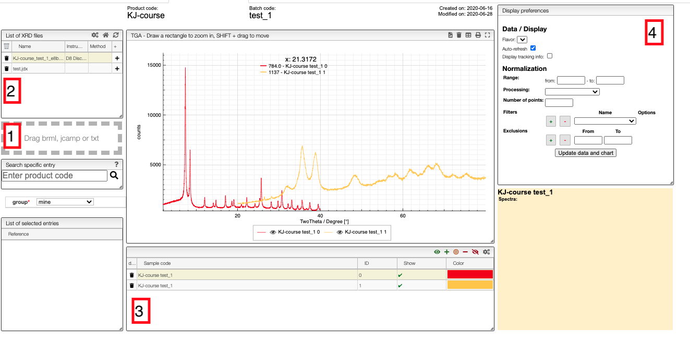
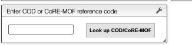

# X-Ray Diffraction Patterns

This module allows visualizing and processing X-Ray diffraction patterns. You can upload `.brml` files which are generated by Bruker machines, `.xy` files generated by PowDLL, and `jcamp` files.

## Upload

Files can be uploaded either by drag-and-drop to the field on the left-hand-side (1 in the image) or automatically from the instrument. The files will appear in field 2. Note that you can only upload files to samples to which you have write access.

## Visualization

To add patterns to the visualizer, click on the `+` in field 2. The sample will then appear in field 3 from which you can control the visualization settings.

If you click on the color in a row, you can select any color you which for the line, and you can use the control buttons in the top right corner of field 3 to control which figures you show in a spectrum.

In the chart you can draw a rectangle to zoom and double click to reset. You can move the graphs by pressing `SHIFT ⇧` while dragging them.

Currently, we only display 2Θ vs. the counts on the detector.

## Processing

Field 4 gives you some basic processing tools. For example, you can get the derivatives of the patterns or normalize it. To scale the maximum intensity to one, you should use the `Rescale (x to y)` option.

## PXRD pattern database lookup

In the ELN you can find a text field in which you can enter a [COD](http://www.crystallography.net/cod/) or [CoRE-MOF](https://zenodo.org/record/3677685#.XzqXbZMzY8M) reference code to obtain the predicted pattern for a structure from those databases.

For example, if you enter [`KAJZIH`](https://www.ccdc.cam.ac.uk/structures/Search?Ccdcid=KAJZIH&DatabaseToSearch=Published) you will find the predicted powder pattern for Cu(I/II)-BTC. As in the other views, you can also generate a smoothed version.

## Prediction

A PXRD pattern can be predicted by either:
- Dropping or pasting a CIF file;
- Inserting the cell parameters (i.e. a, b, c, alpha, beta and gamma) of a given structure;
- Entering a COD or CoRE-MOF reference code (e.g. KAJZIH).

## Feature requests and support

If you need additional tools and support for this module, [Open an issue](https://help.github.com/en/github/managing-your-work-on-github/creating-an-issue) on the [xrd-analysis GitHub repository](https://github.com/cheminfo/xrd-analysis) or simply post a question on the [forum](https://groups.google.com/forum/#!forum/cheminfo).
